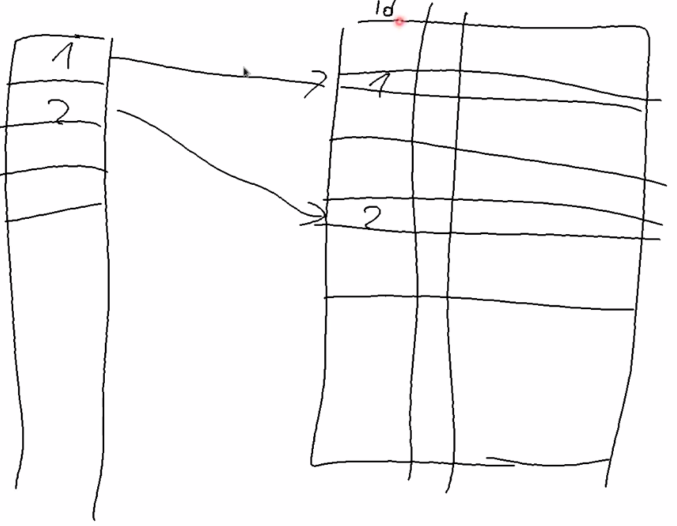

Postgresql trianing - Laurenz Albe

April. 27, 2020

* Read the docs: www.postgresql.org/docs/11/index.html
* Mailing list: www.postgresql.org/list/
  * pgsql-general
  * pgsql-hackers : development list
* Wiki: wiki.postgresql.org

Install
* postgresql-debuginfo package.
  * it doesn't hurt. doesn't slow things down.
  * if you get a crash from pg, then you can create a stack trace for anyone who needs to support you.
  * `perf` tool on linux can be used for performance monitoring.
* postgresql11-contrib
  * defined in appendix F.
  * always install this.
* user: postgres
  * dedicated user to run postgres
* create a database cluster
  * unfortunate name.
  * does not mean mutliple machines.
  * it's like an instance
  * it's a directory with files and a number of processes running against those files.

```text
  cluster

|----------|
| postgres |
|----------| -- (tcp:5432/unix) listen --
| course   |
|----------|
```

you cannot join tables between two different databases.

Shared between databases:

* users
* tablespaces

To create a cluster:

```bash
$ initdb -D $DATA_DIR -E UTF8 --locale=en_US.utf8
```

interesting options:

* --encoding=ENCODING (Always use UTF-8)
* --locale=LOCALE
* --lc-collate, --lc-ctype
  * determines which character is a space, digit etc.
  * collation: determines how string are sorted and ordered. (cannot be changed after db creation)
    * indexes are sorted lists. order is determined by collation for string data type
    * affects order by clauses based on collation in the database.
    * US-english. Or use C or posix locale. C locale is very fast.

* standard data dir: /var/lib/pgsql/11/data

To start:

```bash
$ pg_ctl -D /home/mokha/development/2020-04-pg-training/db/data -l logfile start
```

* 1 server process for each client connection.
  * good isolation

* `psql` is a command line client for connecting to the server.
  * 4 bits of info needed
    * host: -h
    * port: -p
    * database: -d
    * user: -U

```bash
psql -h 127.0.0.1 -p 5432 -U postgres -d postgres
```

How to quit:
  * \q
  * ^d

* \ -> command for the client
* everything else is sent to SQL interpreter
* version 11 supports `exit`

Defaults:
* -h: unix socket
* -U: logged in user
* environment variables
  * PGDATABASE
  * PGHOST
  * PGPORT
  * PGUSER

```sql
CREATE DATABASE course;
```
* creates a copy of an existing database. it uses `template1` database
* you can specify a different template database.

client commands:
  * \?
  * \watch
  * \i FILE
  * \ir RELATIVE_FILE
  * \h: help about client commands
  * \h CREATE DATABASE
  * \l: list databases
  * \d: describe

# Indexes

We need a table that has a certain size.
We'll create a table with a 1M rows.

```sql
CREATE TABLE test(id bigint GENERATED ALWAYS AS IDENTITY NOT NULL, name text NOT NULL);
```

* id is a autogenerated primary key column, without the primary key constraint.
* always use `bigint` which is an 8 byte integer.
  * prevent exhausting possible range of valid integers to choose from for identifier.
  * difference between SERIAL column
    * `CREATE TABLE test2 (id bigserial PRIMARY KEY);`
    * includes a sequence
    * default value is next item in sequence.
    * IDENTITY Column advantage.
      * manually inserting id's can cause collisions with SERIAL.
      * standards compliant so it's more portable between databases.
* `text` has a theoretical limit is 1GB
  * use `text` when the application doesn't have a limit.
  * avoid arbitrary limits like varchar(255).
  * why set limit if there is not limit.
  * there is not performance impact either.
  * nulls make queries difficult, queries are a little more complex which leads to perf issues.
  * recommends: use `not null`. Easy to go from `not null` to allow `null. Harder the other way`. Easy to go from `not null` to allow `null`. Harder the other way.

```sql
INSERT INTO test(name) VALUES ('hans'), ('laurenz');
INSERT INTO test(name) SELECT name FROM test;

TABLE test is like SELECT * FROM test;

CREATE INDEX test_id_idx ON test (id);
```

```psql
# SELECT * FROM test WHERE id = 42;
 id |  name
----+---------
 42 | laurenz
(1 row)

Time: 161.688 ms

# CREATE INDEX test_id_idx ON test (id);
CREATE INDEX
Time: 2106.364 ms (00:02.106)

# SELECT * FROM test WHERE id = 42;
 id |  name
----+---------
 42 | laurenz
(1 row)

Time: 1.682 ms
```

You describe how the result should look like.
The db will figure out how to best do that.

* uuid is 16 bytes wide.
* nothing wrong with it and go ahead and use it.
* nice for distributed generation of identifiers.

# query life cycle

1. query is parsed by parser for syntax.
2. query re-writer.
3. query planner or query optimizer. (AI component that tries to enumerate or walk through different possible ways to execute query.)

Prepend `EXPLAIN` to query to see execution plan

```sql
EXPLAIN SELECT * FROM test WHERE id = 42;
```


```sql
# EXPLAIN SELECT * FROM test WHERE id = 42;
                               QUERY PLAN
-------------------------------------------------------------------------
 Index Scan using test_id_idx on test  (cost=0.43..8.45 rows=1 width=14)
   Index Cond: (id = 42)
(2 rows)

Time: 0.536 ms
```

What do #'s mean?

* cost: no meaning in reality. estimate of cost. from how many rows determines how expensize pg thinks it will be.
* cost=0.43..8.45. initial cost to get first result.. total cost to get all rows.
* rows=1 how many rows it thinks it will return
* width=13 estimated with in bytes.


`\di+ to describe index`

```sql
# \dt+ test
                  List of relations
 Schema | Name | Type  | Owner |  Size  | Description
--------+------+-------+-------+--------+-------------
 public | test | table | mokha | 266 MB |
(1 row)


# \di+ test_id_idx
                          List of relations
 Schema |    Name     | Type  | Owner | Table |  Size  | Description
--------+-------------+-------+-------+-------+--------+-------------
 public | test_id_idx | index | mokha | test  | 135 MB |
(1 row)
```

It made the query faster but we pay a price for having the index.


divided into blocks

------------------
| table rows     | 8K block 0
------------------
| 2 |            | 8K block 1
------------------
| 1 |            | 8K block 2
------------------

tables are unordered.
updates, deletes will change order.
cannot rely on order of items in the table.
database table is also called a HEAP.
It's unordered.
It's a pile of rows.
Indexes are a different affair. sorted list of index items


Index is kept in order.

-----
| 1 | ---> points to a physical location of row in a datafile.
| 2 |
| 3 |

To maintain the order of an index, deletes, updates of data rows means
having to re-order the index. Insert, update and delete statements will
increase cost to maintain index. Indexes will negatively impact performance
for insert, update and deletes.

Who is responsible for indexes?

* do not believe this: `dba has to figure out performance bottleneck and figure out correct indexes.`
* poor dba doesn't understand the data in the table.
  * doesn't know what the data means.
  * doesn't know what has to be fast.
  * in some cases adding an index afterwards cannot improve a bad query.
* during development make sure to choose good indexes.

What are indexes are useful for?

Library visual

* table is a library of books
  * each row is a book
  * shelves are blocks
* library catalogue: ordered list of books (index)

* index can be used for a '<' condition.

```sql
# EXPLAIN SELECT * FROM test WHERE id < 42;
                                QUERY PLAN
--------------------------------------------------------------------------
 Index Scan using test_id_idx on test  (cost=0.43..9.15 rows=41 width=14)
   Index Cond: (id < 42)
(2 rows)

Time: 0.630 ms
```

```sql
# EXPLAIN SELECT * FROM test WHERE id > 4000000000;
                               QUERY PLAN
-------------------------------------------------------------------------
 Index Scan using test_id_idx on test  (cost=0.43..4.45 rows=1 width=14)
   Index Cond: (id > '4000000000'::bigint)
(2 rows)

Time: 0.571 ms
```

* b-tree indexes can be read in both directions. index wasn't used. why?
* pg can use the index but chooses not to use the index.


Back and forth between index and table. This is fine when a few rows to scan.
When a large amount of rows is large. access pattern between heap and index is
rando I/O. Not as good as sequential I/O. Exceeding a large # of rows means
it's more efficient to just do a sequential scan rather than go back and forth between
index and datafiles.

```sql
# EXPLAIN SELECT min(id) FROM test;
                                              QUERY PLAN
------------------------------------------------------------------------------------------------------
 Result  (cost=0.47..0.48 rows=1 width=8)
   InitPlan 1 (returns $0)
     ->  Limit  (cost=0.43..0.47 rows=1 width=8)
           ->  Index Only Scan using test_id_idx on test  (cost=0.43..213123.91 rows=6291456 width=8)
                 Index Cond: (id IS NOT NULL)
(5 rows)

Time: 0.766 ms
```

```sql
# EXPLAIN SELECT * FROM test WHERE id < 1000 ORDER BY id;
                                 QUERY PLAN
----------------------------------------------------------------------------
 Index Scan using test_id_idx on test  (cost=0.43..38.77 rows=991 width=14)
   Index Cond: (id < 1000)
(2 rows)

Time: 0.658 ms
```

* If the order of the index matches the order of the query then this is optimal.

Create index on `name` column

```sql
CREATE INDEX ON test(name);

# EXPLAIN SELECT * FROM test where name = 'laurenz';
                           QUERY PLAN
----------------------------------------------------------------
 Seq Scan on test  (cost=0.00..112651.20 rows=3146147 width=14)
   Filter: (name = 'laurenz'::text)
(2 rows)

Time: 1.250 ms
```

Set parameter to no use a sequential scan if it can

`SET enable_seqscan = off;`
`RESET enable_seqscan;`

## Partial indexes

```sql
DROP INDEX test_name_idx;
CREATE INDEX ON test(name) WHERE name NOT IN ('laurenz', 'hans');
```

* Consequently this index only matches for queries that match the WHERE query.
* smaller index
* indexes only rows where it's useful to have an index.

Constraint: Excludes certain things from the database.

We want to have a primary key.

```sql
ALTER TABLE test ADD PRIMARY KEY(id);
```

An index backing the primary key with a unique constraint.

Soft deletes using `active` true, false.
Apply unique constraint to active rows only.
Add a unique constraint for `active` rows and not on others.
Queries on the `active` rows can be fast.
This way you don't need a large index on all the rows but on only the rows that need them.

```sql
SELECT * FROM test WHERE id = 42 AND name = 'zephanja';
```

`OR` queries makes it harder to use indexes.

```sql
# EXPLAIN SELECT * FROM test WHERE id = 42 OR name = 'zephanja';
                                    QUERY PLAN
----------------------------------------------------------------------------------
 Bitmap Heap Scan on test  (cost=8.88..12.90 rows=1 width=14)
   Recheck Cond: ((id = 42) OR (name = 'zephanja'::text))
   ->  BitmapOr  (cost=8.88..8.88 rows=1 width=0)
         ->  Bitmap Index Scan on test_pkey  (cost=0.00..4.44 rows=1 width=0)
               Index Cond: (id = 42)
         ->  Bitmap Index Scan on test_name_idx  (cost=0.00..4.44 rows=1 width=0)
               Index Cond: (name = 'zephanja'::text)
(7 rows)

Time: 0.652 ms
```

Bitmap index scan: What is this?



Creates a bitmap in memory find matches.
Then make an OR of the two bitmaps to produce a final bitmap that finds rows that matches both conditions.
bitmap is orderd in physical order of the database table.

## Multi-column indexes

When is it useful to have multiple columns in an index?


```sql
DROP INDEX test_name_idx;
ALTER TABLE test DROP CONSTRAINT test_pkey;
CREATE INDEX ON test(id, name);

# \d test
                          Table "public.test"
 Column |  Type  | Collation | Nullable |           Default
--------+--------+-----------+----------+------------------------------
 id     | bigint |           | not null | generated always as identity
 name   | text   |           | not null |
Indexes:
    "test_id_name_idx" btree (id, name)

# \di+ test_id_name_idx
                            List of relations
 Schema |       Name       | Type  | Owner | Table |  Size  | Description
--------+------------------+-------+-------+-------+--------+-------------
 public | test_id_name_idx | index | mokha | test  | 189 MB |
(1 row)


# EXPLAIN SELECT * FROM test WHERE id = 42 AND name = 'zephanja';
                                    QUERY PLAN
-----------------------------------------------------------------------------------
 Index Only Scan using test_id_name_idx on test  (cost=0.43..8.45 rows=1 width=14)
   Index Cond: ((id = 42) AND (name = 'zephanja'::text))
(2 rows)

Time: 1.605 ms
```

A multi-column index can still be used by queries that only filter on the first column.
The index is larger but it still satisfy the needs of the one column and both.


```sql
# EXPLAIN SELECT * FROM test WHERE id = 42;
                                    QUERY PLAN
-----------------------------------------------------------------------------------
 Index Only Scan using test_id_name_idx on test  (cost=0.43..8.45 rows=1 width=14)
   Index Cond: (id = 42)
(2 rows)

Time: 0.447 ms
```

However, index cannot be used if the secondary column in the index is used as the only item in the query.

```sql
# EXPLAIN SELECT * FROM test WHERE name = 'zephanja';
                               QUERY PLAN
------------------------------------------------------------------------
 Gather  (cost=1000.00..67776.10 rows=1 width=14)
   Workers Planned: 2
   ->  Parallel Seq Scan on test  (cost=0.00..66776.00 rows=1 width=14)
         Filter: (name = 'zephanja'::text)
(4 rows)

Time: 0.476 ms
```

What about?

```sql
# EXPLAIN SELECT * FROM test WHERE id = 42 AND name < 'smith';
                                    QUERY PLAN
-----------------------------------------------------------------------------------
 Index Only Scan using test_id_name_idx on test  (cost=0.43..8.45 rows=1 width=14)
   Index Cond: ((id = 42) AND (name < 'smith'::text))
(2 rows)

Time: 0.597 ms
```

Index can use both conditions.

```sql
# EXPLAIN SELECT * FROM test WHERE id < 42 ORDER BY name;
                                        QUERY PLAN
-------------------------------------------------------------------------------------------
 Sort  (cost=80.25..80.35 rows=41 width=14)
   Sort Key: name
   ->  Index Only Scan using test_id_name_idx on test  (cost=0.43..79.15 rows=41 width=14)
         Index Cond: (id < 42)
(4 rows)

Time: 0.434 ms
```

## Expressions

```sql
# \d test
                          Table "public.test"
 Column |  Type  | Collation | Nullable |           Default
--------+--------+-----------+----------+------------------------------
 id     | bigint |           | not null | generated always as identity
 name   | text   |           | not null |
Indexes:
    "test_name_idx" btree (name)
```

Case insensitive search.

one way `WHERE upper(name) = upper('zephanja');`

```sql
# EXPLAIN SELECT * FROM test WHERE upper(name) = upper('zephanja');
                                 QUERY PLAN
----------------------------------------------------------------------------
 Gather  (cost=1000.00..77475.30 rows=31457 width=14)
   Workers Planned: 2
   ->  Parallel Seq Scan on test  (cost=0.00..73329.60 rows=13107 width=14)
         Filter: (upper(name) = 'ZEPHANJA'::text)
(4 rows)

Time: 1.444 ms
```

Index not used.

Create index on expression;

```sql
CREATE INDEX on test (upper(name));

# EXPLAIN SELECT * FROM test WHERE upper(name) = upper('zephanja');
                                    QUERY PLAN
-----------------------------------------------------------------------------------
 Bitmap Heap Scan on test  (cost=592.22..35783.53 rows=31457 width=14)
   Recheck Cond: (upper(name) = 'ZEPHANJA'::text)
   ->  Bitmap Index Scan on test_upper_idx  (cost=0.00..584.36 rows=31457 width=0)
         Index Cond: (upper(name) = 'ZEPHANJA'::text)
(4 rows)

Time: 1.049 ms
```

`ANALYZE` command

```sql
ANALYZE test;
# EXPLAIN SELECT * FROM test WHERE upper(name) = upper('zephanja');
                                 QUERY PLAN
----------------------------------------------------------------------------
 Index Scan using test_upper_idx on test  (cost=0.43..7.44 rows=1 width=14)
   Index Cond: (upper(name) = 'ZEPHANJA'::text)
(2 rows)

Time: 0.909 ms
```

* postgres: autovacuum launcher

```sql
# SELECT * FROM pg_stats WHERE tablename = 'test' AND attname = 'name';
-[ RECORD 1 ]----------+--------------------
schemaname             | public
tablename              | test
attname                | name
inherited              | f
null_frac              | 0
avg_width              | 6
n_distinct             | 2
most_common_vals       | {hans,laurenz}
most_common_freqs      | {0.505233,0.494767}
histogram_bounds       | [NULL]
correlation            | 0.503458
most_common_elems      | [NULL]
most_common_elem_freqs | [NULL]
elem_count_histogram   | [NULL]

Time: 2.666 ms
```

# Extensions

* command `\dx+`

`CREATE EXTENSION citext;`
`DROP EXTENSION citext`;

* /usr/share/pgsql/extension/ : extensions directory
* /usr/share/pgsql/extension/citext--1.4.sql : sql file for citext extension
* /usr/share/pgsql/extension/citext.control : control file for working with extension
* /usr/share/pgsql/extension/citext--1.4--1.5.sql : upgrade file from v1.4 to v1.5 of the extension
```

Sometimes you need to change the query to optimize it instead of depending
on an index.

```sql
SELECT * FROM person WHERE age(birthday) < INTERVAL '40 years';
CREATE INDEX ON person (age(birthday));
ERROR: functions in index expression must be marked IMMUTABLE

SELECT * FROM person WHERE birthday < current_timestamp - INTERVAL '40 years';
```

```sql
SELECT * FROM test WHERE name LIKE '%ephanj%';
SELECT * FROM test WHERE name LIKE 'zephanj%';

# EXPLAIN SELECT * FROM test WHERE name LIKE 'zephan%';
                               QUERY PLAN
------------------------------------------------------------------------
 Gather  (cost=1000.00..67776.23 rows=1 width=14)
   Workers Planned: 2
   ->  Parallel Seq Scan on test  (cost=0.00..66776.12 rows=1 width=14)
         Filter: (name ~~ 'zephan%'::text)
(4 rows)

Time: 1.261 ms
```

Why?

```sql
# SELECT 'c' < 'd';
 ?column?
----------
 t
(1 row)

Time: 0.338 ms

# SELECT 'ch' < 'd';
 ?column?
----------
 t
(1 row)

Time: 0.344 ms

# SELECT 'ch' < 'd' COLLATE "cs_CZ.utf8";
 ?column?
----------
 f
(1 row)

Time: 2.935 ms
```

* c library or icu library

```sql
# CREATE INDEX ON test (name text_pattern_ops);
CREATE INDEX
Time: 5361.821 ms (00:05.362)

# EXPLAIN SELECT * FROM test WHERE name LIKE 'zephan%';
                                 QUERY PLAN
----------------------------------------------------------------------------
 Index Scan using test_name_idx1 on test  (cost=0.43..8.45 rows=1 width=14)
   Index Cond: ((name ~>=~ 'zephan'::text) AND (name ~<~ 'zephao'::text))
   Filter: (name ~~ 'zephan%'::text)
(3 rows)

Time: 1.377 ms
```

Use `text_pattern_ops` operator class index for case insensitive search that can leverage an index.


Different ways to index data.

```sql
# TABLE pg_am;
 amname |  amhandler  | amtype
--------+-------------+--------
 btree  | bthandler   | i
 hash   | hashhandler | i
 gist   | gisthandler | i
 gin    | ginhandler  | i
 spgist | spghandler  | i
 brin   | brinhandler | i
(6 rows)

Time: 0.968 ms
```

When do you need a different index access method?

`btree` indexes are well understood.
limitation: can only be used for datatypes that have a total ordering.

There are datatypes where you cannot order them.
If the data cannot be ordered then it cannot fit into a btree index.
E.g. composite data types or JSON datatype, geometric data types or points.

```sql
# SELECT JSONB '{"a": 2, "b": [1, 2, 3]}';
          jsonb
--------------------------
 {"a": 2, "b": [1, 2, 3]}
(1 row)

Time: 0.330 ms

SELECT point '(10, 20)';

# SELECT ARRAY[1, 2, 3, 55];
   array
------------
 {1,2,3,55}
(1 row)

Time: 0.313 ms
```

`gist` and `gin` indexes.

For composite datatypes like json, point, array then use `gin` indexes.
Weird data types then use `gist` like geometry and time ranges.


## JSON data in the database.

```sql
CREATE TABLE json(id bigint PRIMARY KEY, j json NOT NULL);
INSERT INTO json VALUES (1, '{"a": 2, "b": [1, 2, 3]}');
INSERT INTO json VALUES (2, '{"a": false, "b": [4, 5, 6], "extra": "yes"}');

# SELECT j->>'a' FROM json where id = 2;
 ?column?
----------
 false
(1 row)

Time: 0.779 ms

# SELECT * FROM json WHERE j->>'a' = '2';
 id |            j
----+--------------------------
  1 | {"a": 2, "b": [1, 2, 3]}
(1 row)

Time: 0.577 ms

# ALTER TABLE json ALTER j TYPE jsonb;
ALTER TABLE
Time: 4.560 ms

# SELECT * FROM json WHERE j @> '{"b": [3]}';
 id |            j
----+--------------------------
  1 | {"a": 2, "b": [1, 2, 3]}
(1 row)

Time: 0.973 ms

# EXPLAIN SELECT * FROM json WHERE j @> '{"b": [3]}';
                     QUERY PLAN
-----------------------------------------------------
 Seq Scan on json  (cost=0.00..1.02 rows=1 width=40)
   Filter: (j @> '{"b": [3]}'::jsonb)
(2 rows)

Time: 0.491 ms

# CREATE INDEX ON json USING gin (j);
CREATE INDEX
Time: 1.517 ms


# SET enable_seqscan = off;
SET
Time: 0.238 ms

# EXPLAIN SELECT * FROM json WHERE j @> '{"b": [3]}';
                                QUERY PLAN
--------------------------------------------------------------------------
 Bitmap Heap Scan on json  (cost=12.00..16.01 rows=1 width=40)
   Recheck Cond: (j @> '{"b": [3]}'::jsonb)
   ->  Bitmap Index Scan on json_j_idx  (cost=0.00..12.00 rows=1 width=0)
         Index Cond: (j @> '{"b": [3]}'::jsonb)
(4 rows)

Time: 0.625 ms

# TABLE json;
 id |                      j
----+----------------------------------------------
  1 | {"a": 2, "b": [1, 2, 3]}
  2 | {"a": false, "b": [4, 5, 6], "extra": "yes"}
(2 rows)

Time: 0.376 ms
```
