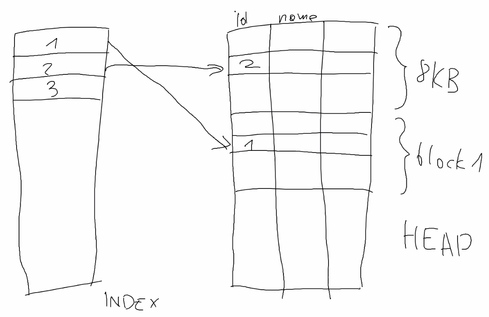
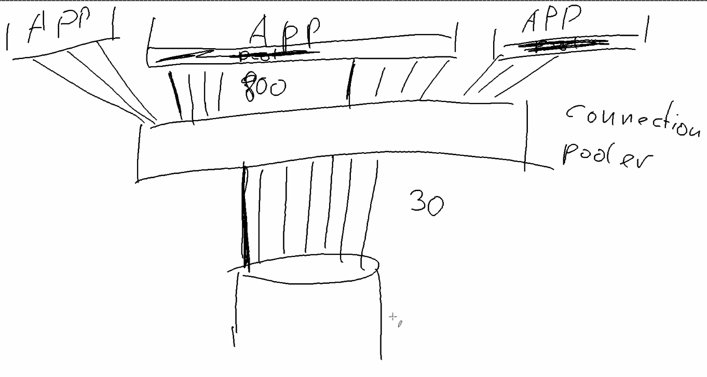
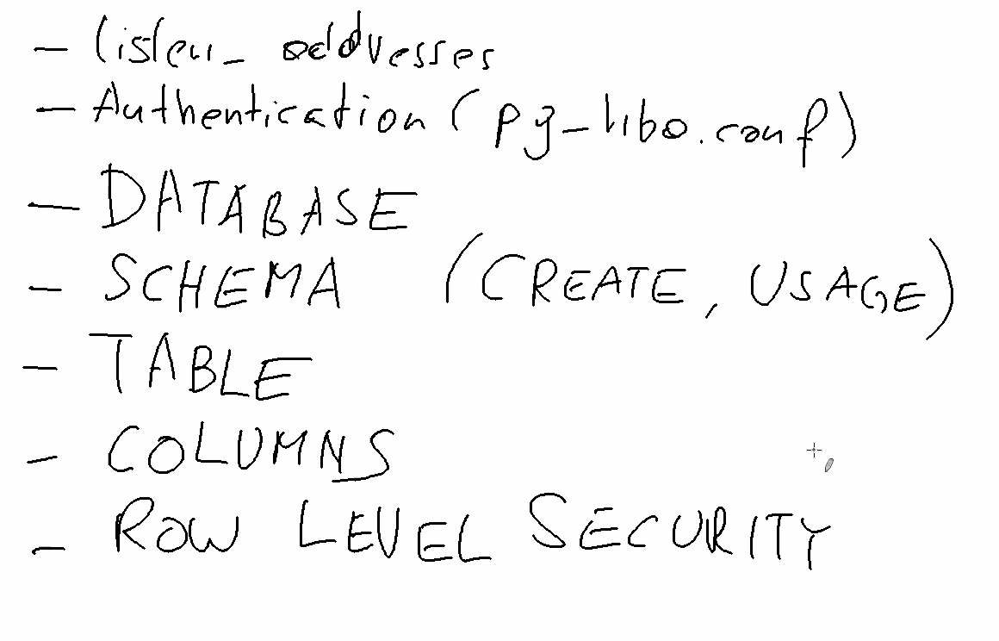
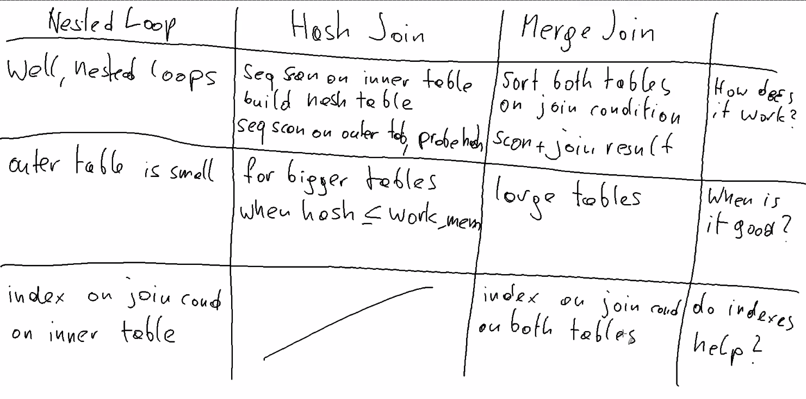

Postgresql trianing - Laurenz Albe

April. 27, 2020

* Read the docs: www.postgresql.org/docs/11/index.html
* Mailing list: www.postgresql.org/list/
  * pgsql-general
  * pgsql-hackers : development list
* Wiki: wiki.postgresql.org

Install
* postgresql-debuginfo package.
  * it doesn't hurt. doesn't slow things down.
  * if you get a crash from pg, then you can create a stack trace for anyone who needs to support you.
  * `perf` tool on linux can be used for performance monitoring.
* postgresql11-contrib
  * defined in appendix F.
  * always install this.
* user: postgres
  * dedicated user to run postgres
* create a database cluster
  * unfortunate name.
  * does not mean mutliple machines.
  * it's like an instance
  * it's a directory with files and a number of processes running against those files.

```text
  cluster

|----------|
| postgres |
|----------| -- (tcp:5432/unix) listen --
| course   |
|----------|
```

you cannot join tables between two different databases.

Shared between databases:

* users
* tablespaces

To create a cluster:

```bash
$ initdb -D $DATA_DIR -E UTF8 --locale=en_US.utf8
```

interesting options:

* --encoding=ENCODING (Always use UTF-8)
* --locale=LOCALE
* --lc-collate, --lc-ctype
  * determines which character is a space, digit etc.
  * collation: determines how string are sorted and ordered. (cannot be changed after db creation)
    * indexes are sorted lists. order is determined by collation for string data type
    * affects order by clauses based on collation in the database.
    * US-english. Or use C or posix locale. C locale is very fast.

* standard data dir: /var/lib/pgsql/11/data

To start:

```bash
$ pg_ctl -D /home/mokha/development/2020-04-pg-training/db/data -l logfile start
```

* 1 server process for each client connection.
  * good isolation

* `psql` is a command line client for connecting to the server.
  * 4 bits of info needed
    * host: -h
    * port: -p
    * database: -d
    * user: -U

```bash
psql -h 127.0.0.1 -p 5432 -U postgres -d postgres
```

How to quit:
  * \q
  * ^d

* \ -> command for the client
* everything else is sent to SQL interpreter
* version 11 supports `exit`

Defaults:
* -h: unix socket
* -U: logged in user
* environment variables
  * PGDATABASE
  * PGHOST
  * PGPORT
  * PGUSER

```sql
CREATE DATABASE course;
```
* creates a copy of an existing database. it uses `template1` database
* you can specify a different template database.

client commands:
  * \?
  * \watch
  * \i FILE
  * \ir RELATIVE_FILE
  * \h: help about client commands
  * \h CREATE DATABASE
  * \l: list databases
  * \d: describe

# Indexes

We need a table that has a certain size.
We'll create a table with a 1M rows.

```sql
CREATE TABLE test(id bigint GENERATED ALWAYS AS IDENTITY NOT NULL, name text NOT NULL);
```

* id is a autogenerated primary key column, without the primary key constraint.
* always use `bigint` which is an 8 byte integer.
  * prevent exhausting possible range of valid integers to choose from for identifier.
  * difference between SERIAL column
    * `CREATE TABLE test2 (id bigserial PRIMARY KEY);`
    * includes a sequence
    * default value is next item in sequence.
    * IDENTITY Column advantage.
      * manually inserting id's can cause collisions with SERIAL.
      * standards compliant so it's more portable between databases.
* `text` has a theoretical limit is 1GB
  * use `text` when the application doesn't have a limit.
  * avoid arbitrary limits like varchar(255).
  * why set limit if there is not limit.
  * there is not performance impact either.
  * nulls make queries difficult, queries are a little more complex which leads to perf issues.
  * recommends: use `not null`. Easy to go from `not null` to allow `null. Harder the other way`. Easy to go from `not null` to allow `null`. Harder the other way.

```sql
INSERT INTO test(name) VALUES ('hans'), ('laurenz');
INSERT INTO test(name) SELECT name FROM test;

TABLE test is like SELECT * FROM test;

CREATE INDEX test_id_idx ON test (id);
```

```psql
# SELECT * FROM test WHERE id = 42;
 id |  name
----+---------
 42 | laurenz
(1 row)

Time: 161.688 ms

# CREATE INDEX test_id_idx ON test (id);
CREATE INDEX
Time: 2106.364 ms (00:02.106)

# SELECT * FROM test WHERE id = 42;
 id |  name
----+---------
 42 | laurenz
(1 row)

Time: 1.682 ms
```

You describe how the result should look like.
The db will figure out how to best do that.

* uuid is 16 bytes wide.
* nothing wrong with it and go ahead and use it.
* nice for distributed generation of identifiers.

# query life cycle

1. query is parsed by parser for syntax.
2. query re-writer.
3. query planner or query optimizer. (AI component that tries to enumerate or walk through different possible ways to execute query.)

Prepend `EXPLAIN` to query to see execution plan

```sql
EXPLAIN SELECT * FROM test WHERE id = 42;
```


```sql
# EXPLAIN SELECT * FROM test WHERE id = 42;
                               QUERY PLAN
-------------------------------------------------------------------------
 Index Scan using test_id_idx on test  (cost=0.43..8.45 rows=1 width=14)
   Index Cond: (id = 42)
(2 rows)

Time: 0.536 ms
```

What do #'s mean?

* cost: no meaning in reality. estimate of cost. from how many rows determines how expensize pg thinks it will be.
* cost=0.43..8.45. initial cost to get first result.. total cost to get all rows.
* rows=1 how many rows it thinks it will return
* width=13 estimated with in bytes.


`\di+ to describe index`

```sql
# \dt+ test
                  List of relations
 Schema | Name | Type  | Owner |  Size  | Description
--------+------+-------+-------+--------+-------------
 public | test | table | mokha | 266 MB |
(1 row)


# \di+ test_id_idx
                          List of relations
 Schema |    Name     | Type  | Owner | Table |  Size  | Description
--------+-------------+-------+-------+-------+--------+-------------
 public | test_id_idx | index | mokha | test  | 135 MB |
(1 row)
```

It made the query faster but we pay a price for having the index.


divided into blocks

------------------
| table rows     | 8K block 0
------------------
| 2 |            | 8K block 1
------------------
| 1 |            | 8K block 2
------------------

tables are unordered.
updates, deletes will change order.
cannot rely on order of items in the table.
database table is also called a HEAP.
It's unordered.
It's a pile of rows.
Indexes are a different affair. sorted list of index items


Index is kept in order.

-----
| 1 | ---> points to a physical location of row in a datafile.
| 2 |
| 3 |

To maintain the order of an index, deletes, updates of data rows means
having to re-order the index. Insert, update and delete statements will
increase cost to maintain index. Indexes will negatively impact performance
for insert, update and deletes.

Who is responsible for indexes?

* do not believe this: `dba has to figure out performance bottleneck and figure out correct indexes.`
* poor dba doesn't understand the data in the table.
  * doesn't know what the data means.
  * doesn't know what has to be fast.
  * in some cases adding an index afterwards cannot improve a bad query.
* during development make sure to choose good indexes.

What are indexes are useful for?

Library visual

* table is a library of books
  * each row is a book
  * shelves are blocks
* library catalogue: ordered list of books (index)

* index can be used for a '<' condition.

```sql
# EXPLAIN SELECT * FROM test WHERE id < 42;
                                QUERY PLAN
--------------------------------------------------------------------------
 Index Scan using test_id_idx on test  (cost=0.43..9.15 rows=41 width=14)
   Index Cond: (id < 42)
(2 rows)

Time: 0.630 ms
```

```sql
# EXPLAIN SELECT * FROM test WHERE id > 4000000000;
                               QUERY PLAN
-------------------------------------------------------------------------
 Index Scan using test_id_idx on test  (cost=0.43..4.45 rows=1 width=14)
   Index Cond: (id > '4000000000'::bigint)
(2 rows)

Time: 0.571 ms
```

* b-tree indexes can be read in both directions. index wasn't used. why?
* pg can use the index but chooses not to use the index.



Back and forth between index and table. This is fine when a few rows to scan.
When a large amount of rows is large. access pattern between heap and index is
rando I/O. Not as good as sequential I/O. Exceeding a large # of rows means
it's more efficient to just do a sequential scan rather than go back and forth between
index and datafiles.

```sql
# EXPLAIN SELECT min(id) FROM test;
                                              QUERY PLAN
------------------------------------------------------------------------------------------------------
 Result  (cost=0.47..0.48 rows=1 width=8)
   InitPlan 1 (returns $0)
     ->  Limit  (cost=0.43..0.47 rows=1 width=8)
           ->  Index Only Scan using test_id_idx on test  (cost=0.43..213123.91 rows=6291456 width=8)
                 Index Cond: (id IS NOT NULL)
(5 rows)

Time: 0.766 ms
```

```sql
# EXPLAIN SELECT * FROM test WHERE id < 1000 ORDER BY id;
                                 QUERY PLAN
----------------------------------------------------------------------------
 Index Scan using test_id_idx on test  (cost=0.43..38.77 rows=991 width=14)
   Index Cond: (id < 1000)
(2 rows)

Time: 0.658 ms
```

* If the order of the index matches the order of the query then this is optimal.

Create index on `name` column

```sql
CREATE INDEX ON test(name);

# EXPLAIN SELECT * FROM test where name = 'laurenz';
                           QUERY PLAN
----------------------------------------------------------------
 Seq Scan on test  (cost=0.00..112651.20 rows=3146147 width=14)
   Filter: (name = 'laurenz'::text)
(2 rows)

Time: 1.250 ms
```

Set parameter to no use a sequential scan if it can

`SET enable_seqscan = off;`
`RESET enable_seqscan;`

## Partial indexes

```sql
DROP INDEX test_name_idx;
CREATE INDEX ON test(name) WHERE name NOT IN ('laurenz', 'hans');
```

* Consequently this index only matches for queries that match the WHERE query.
* smaller index
* indexes only rows where it's useful to have an index.

Constraint: Excludes certain things from the database.

We want to have a primary key.

```sql
ALTER TABLE test ADD PRIMARY KEY(id);
```

An index backing the primary key with a unique constraint.

Soft deletes using `active` true, false.
Apply unique constraint to active rows only.
Add a unique constraint for `active` rows and not on others.
Queries on the `active` rows can be fast.
This way you don't need a large index on all the rows but on only the rows that need them.

```sql
SELECT * FROM test WHERE id = 42 AND name = 'zephanja';
```

`OR` queries makes it harder to use indexes.

```sql
# EXPLAIN SELECT * FROM test WHERE id = 42 OR name = 'zephanja';
                                    QUERY PLAN
----------------------------------------------------------------------------------
 Bitmap Heap Scan on test  (cost=8.88..12.90 rows=1 width=14)
   Recheck Cond: ((id = 42) OR (name = 'zephanja'::text))
   ->  BitmapOr  (cost=8.88..8.88 rows=1 width=0)
         ->  Bitmap Index Scan on test_pkey  (cost=0.00..4.44 rows=1 width=0)
               Index Cond: (id = 42)
         ->  Bitmap Index Scan on test_name_idx  (cost=0.00..4.44 rows=1 width=0)
               Index Cond: (name = 'zephanja'::text)
(7 rows)

Time: 0.652 ms
```

Bitmap index scan: What is this?


Creates a bitmap in memory find matches.
Then make an OR of the two bitmaps to produce a final bitmap that finds rows that matches both conditions.
bitmap is orderd in physical order of the database table.

## Multi-column indexes

When is it useful to have multiple columns in an index?


```sql
DROP INDEX test_name_idx;
ALTER TABLE test DROP CONSTRAINT test_pkey;
CREATE INDEX ON test(id, name);

# \d test
                          Table "public.test"
 Column |  Type  | Collation | Nullable |           Default
--------+--------+-----------+----------+------------------------------
 id     | bigint |           | not null | generated always as identity
 name   | text   |           | not null |
Indexes:
    "test_id_name_idx" btree (id, name)

# \di+ test_id_name_idx
                            List of relations
 Schema |       Name       | Type  | Owner | Table |  Size  | Description
--------+------------------+-------+-------+-------+--------+-------------
 public | test_id_name_idx | index | mokha | test  | 189 MB |
(1 row)


# EXPLAIN SELECT * FROM test WHERE id = 42 AND name = 'zephanja';
                                    QUERY PLAN
-----------------------------------------------------------------------------------
 Index Only Scan using test_id_name_idx on test  (cost=0.43..8.45 rows=1 width=14)
   Index Cond: ((id = 42) AND (name = 'zephanja'::text))
(2 rows)

Time: 1.605 ms
```

A multi-column index can still be used by queries that only filter on the first column.
The index is larger but it still satisfy the needs of the one column and both.


```sql
# EXPLAIN SELECT * FROM test WHERE id = 42;
                                    QUERY PLAN
-----------------------------------------------------------------------------------
 Index Only Scan using test_id_name_idx on test  (cost=0.43..8.45 rows=1 width=14)
   Index Cond: (id = 42)
(2 rows)

Time: 0.447 ms
```

However, index cannot be used if the secondary column in the index is used as the only item in the query.

```sql
# EXPLAIN SELECT * FROM test WHERE name = 'zephanja';
                               QUERY PLAN
------------------------------------------------------------------------
 Gather  (cost=1000.00..67776.10 rows=1 width=14)
   Workers Planned: 2
   ->  Parallel Seq Scan on test  (cost=0.00..66776.00 rows=1 width=14)
         Filter: (name = 'zephanja'::text)
(4 rows)

Time: 0.476 ms
```

What about?

```sql
# EXPLAIN SELECT * FROM test WHERE id = 42 AND name < 'smith';
                                    QUERY PLAN
-----------------------------------------------------------------------------------
 Index Only Scan using test_id_name_idx on test  (cost=0.43..8.45 rows=1 width=14)
   Index Cond: ((id = 42) AND (name < 'smith'::text))
(2 rows)

Time: 0.597 ms
```

Index can use both conditions.

```sql
# EXPLAIN SELECT * FROM test WHERE id < 42 ORDER BY name;
                                        QUERY PLAN
-------------------------------------------------------------------------------------------
 Sort  (cost=80.25..80.35 rows=41 width=14)
   Sort Key: name
   ->  Index Only Scan using test_id_name_idx on test  (cost=0.43..79.15 rows=41 width=14)
         Index Cond: (id < 42)
(4 rows)

Time: 0.434 ms
```

## Expressions

```sql
# \d test
                          Table "public.test"
 Column |  Type  | Collation | Nullable |           Default
--------+--------+-----------+----------+------------------------------
 id     | bigint |           | not null | generated always as identity
 name   | text   |           | not null |
Indexes:
    "test_name_idx" btree (name)
```

Case insensitive search.

one way `WHERE upper(name) = upper('zephanja');`

```sql
# EXPLAIN SELECT * FROM test WHERE upper(name) = upper('zephanja');
                                 QUERY PLAN
----------------------------------------------------------------------------
 Gather  (cost=1000.00..77475.30 rows=31457 width=14)
   Workers Planned: 2
   ->  Parallel Seq Scan on test  (cost=0.00..73329.60 rows=13107 width=14)
         Filter: (upper(name) = 'ZEPHANJA'::text)
(4 rows)

Time: 1.444 ms
```

Index not used.

Create index on expression;

```sql
CREATE INDEX on test (upper(name));

# EXPLAIN SELECT * FROM test WHERE upper(name) = upper('zephanja');
                                    QUERY PLAN
-----------------------------------------------------------------------------------
 Bitmap Heap Scan on test  (cost=592.22..35783.53 rows=31457 width=14)
   Recheck Cond: (upper(name) = 'ZEPHANJA'::text)
   ->  Bitmap Index Scan on test_upper_idx  (cost=0.00..584.36 rows=31457 width=0)
         Index Cond: (upper(name) = 'ZEPHANJA'::text)
(4 rows)

Time: 1.049 ms
```

`ANALYZE` command

```sql
ANALYZE test;
# EXPLAIN SELECT * FROM test WHERE upper(name) = upper('zephanja');
                                 QUERY PLAN
----------------------------------------------------------------------------
 Index Scan using test_upper_idx on test  (cost=0.43..7.44 rows=1 width=14)
   Index Cond: (upper(name) = 'ZEPHANJA'::text)
(2 rows)

Time: 0.909 ms
```

* postgres: autovacuum launcher

```sql
# SELECT * FROM pg_stats WHERE tablename = 'test' AND attname = 'name';
-[ RECORD 1 ]----------+--------------------
schemaname             | public
tablename              | test
attname                | name
inherited              | f
null_frac              | 0
avg_width              | 6
n_distinct             | 2
most_common_vals       | {hans,laurenz}
most_common_freqs      | {0.505233,0.494767}
histogram_bounds       | [NULL]
correlation            | 0.503458
most_common_elems      | [NULL]
most_common_elem_freqs | [NULL]
elem_count_histogram   | [NULL]

Time: 2.666 ms
```

# Extensions

* command `\dx+`

`CREATE EXTENSION citext;`
`DROP EXTENSION citext`;

* /usr/share/pgsql/extension/ : extensions directory
* /usr/share/pgsql/extension/citext--1.4.sql : sql file for citext extension
* /usr/share/pgsql/extension/citext.control : control file for working with extension
* /usr/share/pgsql/extension/citext--1.4--1.5.sql : upgrade file from v1.4 to v1.5 of the extension
```

Sometimes you need to change the query to optimize it instead of depending
on an index.

```sql
SELECT * FROM person WHERE age(birthday) < INTERVAL '40 years';
CREATE INDEX ON person (age(birthday));
ERROR: functions in index expression must be marked IMMUTABLE

SELECT * FROM person WHERE birthday < current_timestamp - INTERVAL '40 years';
```

```sql
SELECT * FROM test WHERE name LIKE '%ephanj%';
SELECT * FROM test WHERE name LIKE 'zephanj%';

# EXPLAIN SELECT * FROM test WHERE name LIKE 'zephan%';
                               QUERY PLAN
------------------------------------------------------------------------
 Gather  (cost=1000.00..67776.23 rows=1 width=14)
   Workers Planned: 2
   ->  Parallel Seq Scan on test  (cost=0.00..66776.12 rows=1 width=14)
         Filter: (name ~~ 'zephan%'::text)
(4 rows)

Time: 1.261 ms
```

Why?

```sql
# SELECT 'c' < 'd';
 ?column?
----------
 t
(1 row)

Time: 0.338 ms

# SELECT 'ch' < 'd';
 ?column?
----------
 t
(1 row)

Time: 0.344 ms

# SELECT 'ch' < 'd' COLLATE "cs_CZ.utf8";
 ?column?
----------
 f
(1 row)

Time: 2.935 ms
```

* c library or icu library

```sql
# CREATE INDEX ON test (name text_pattern_ops);
CREATE INDEX
Time: 5361.821 ms (00:05.362)

# EXPLAIN SELECT * FROM test WHERE name LIKE 'zephan%';
                                 QUERY PLAN
----------------------------------------------------------------------------
 Index Scan using test_name_idx1 on test  (cost=0.43..8.45 rows=1 width=14)
   Index Cond: ((name ~>=~ 'zephan'::text) AND (name ~<~ 'zephao'::text))
   Filter: (name ~~ 'zephan%'::text)
(3 rows)

Time: 1.377 ms
```

Use `text_pattern_ops` operator class index for case insensitive search that can leverage an index.


Different ways to index data.

```sql
# TABLE pg_am;
 amname |  amhandler  | amtype
--------+-------------+--------
 btree  | bthandler   | i
 hash   | hashhandler | i
 gist   | gisthandler | i
 gin    | ginhandler  | i
 spgist | spghandler  | i
 brin   | brinhandler | i
(6 rows)

Time: 0.968 ms
```

When do you need a different index access method?

`btree` indexes are well understood.
limitation: can only be used for datatypes that have a total ordering.

There are datatypes where you cannot order them.
If the data cannot be ordered then it cannot fit into a btree index.
E.g. composite data types or JSON datatype, geometric data types or points.

```sql
# SELECT JSONB '{"a": 2, "b": [1, 2, 3]}';
          jsonb
--------------------------
 {"a": 2, "b": [1, 2, 3]}
(1 row)

Time: 0.330 ms

SELECT point '(10, 20)';

# SELECT ARRAY[1, 2, 3, 55];
   array
------------
 {1,2,3,55}
(1 row)

Time: 0.313 ms
```

`gist` and `gin` indexes.

For composite datatypes like json, point, array then use `gin` indexes.
Weird data types then use `gist` like geometry and time ranges.


## JSON data in the database.

```sql
CREATE TABLE json(id bigint PRIMARY KEY, j json NOT NULL);
INSERT INTO json VALUES (1, '{"a": 2, "b": [1, 2, 3]}');
INSERT INTO json VALUES (2, '{"a": false, "b": [4, 5, 6], "extra": "yes"}');

# SELECT j->>'a' FROM json where id = 2;
 ?column?
----------
 false
(1 row)

Time: 0.779 ms

# SELECT * FROM json WHERE j->>'a' = '2';
 id |            j
----+--------------------------
  1 | {"a": 2, "b": [1, 2, 3]}
(1 row)

Time: 0.577 ms

# ALTER TABLE json ALTER j TYPE jsonb;
ALTER TABLE
Time: 4.560 ms

# SELECT * FROM json WHERE j @> '{"b": [3]}';
 id |            j
----+--------------------------
  1 | {"a": 2, "b": [1, 2, 3]}
(1 row)

Time: 0.973 ms

# EXPLAIN SELECT * FROM json WHERE j @> '{"b": [3]}';
                     QUERY PLAN
-----------------------------------------------------
 Seq Scan on json  (cost=0.00..1.02 rows=1 width=40)
   Filter: (j @> '{"b": [3]}'::jsonb)
(2 rows)

Time: 0.491 ms

# CREATE INDEX ON json USING gin (j);
CREATE INDEX
Time: 1.517 ms


# SET enable_seqscan = off;
SET
Time: 0.238 ms

# EXPLAIN SELECT * FROM json WHERE j @> '{"b": [3]}';
                                QUERY PLAN
--------------------------------------------------------------------------
 Bitmap Heap Scan on json  (cost=12.00..16.01 rows=1 width=40)
   Recheck Cond: (j @> '{"b": [3]}'::jsonb)
   ->  Bitmap Index Scan on json_j_idx  (cost=0.00..12.00 rows=1 width=0)
         Index Cond: (j @> '{"b": [3]}'::jsonb)
(4 rows)

Time: 0.625 ms

# TABLE json;
 id |                      j
----+----------------------------------------------
  1 | {"a": 2, "b": [1, 2, 3]}
  2 | {"a": false, "b": [4, 5, 6], "extra": "yes"}
(2 rows)

Time: 0.376 ms
```


## `gist` index example

```sql
CREATE TABLE reservation (
  id bigint PRIMARY KEY,
  name text NOT NULL,
  res_from timestamp,
  res_to timestamp
);

# Better way is to use a range type

CREATE TABLE reservation (
  id bigint PRIMARY KEY,
  name text NOT NULL,
  res tsrange NOT NULL
);

INSERT INTO reservation VALUES (1, 'room 1', '[2020-04-24 9:00:00,2020-04-24 12:00:00]');

SELECT * FROM reservation WHERE res && '[2020-04-24 9:00:00,2020-04-24 12:00:00]';
# EXPLAIN SELECT * FROM reservation WHERE res && '[2020-04-24 9:00:00,2020-04-24 12:00:00]';
                                   QUERY PLAN
--------------------------------------------------------------------------------
 Seq Scan on reservation  (cost=10000000000.00..10000000020.12 rows=8 width=72)
   Filter: (res && '["2020-04-24 09:00:00","2020-04-24 12:00:00"]'::tsrange)
(2 rows)

Time: 0.551 ms

# SHOW enable_seqscan;
 enable_seqscan
 ----------------
  off
  (1 row)

CREATE INDEX ON reservation USING gist (res);
# EXPLAIN SELECT * FROM reservation WHERE res && '[2020-04-24 9:00:00,2020-04-24 12:00:00]';
                                       QUERY PLAN
----------------------------------------------------------------------------------------
 Index Scan using reservation_res_idx on reservation  (cost=0.12..8.14 rows=1 width=72)
   Index Cond: (res && '["2020-04-24 09:00:00","2020-04-24 12:00:00"]'::tsrange)
(2 rows)

Time: 0.774 ms
```

Add constraint to prevent overlap. Exclusion constraint and it uses gist indexes.

```sql
ALTER TABLE reservation ADD EXCLUDE USING gist(res WITH &&);

# INSERT INTO reservation VALUES (2, 'room 1', '[2020-04-24 9:00:00,2020-04-24 12:00:00]');
ERROR:  23P01: conflicting key value violates exclusion constraint "reservation_res_excl"
DETAIL:  Key (res)=(["2020-04-24 09:00:00","2020-04-24 12:00:00"]) conflicts with existing key (res)=(["2020-04-24 09:00:00","2020-04-24 12:00:00")).
SCHEMA NAME:  public
TABLE NAME:  reservation
CONSTRAINT NAME:  reservation_res_excl
LOCATION:  check_exclusion_or_unique_constraint, execIndexing.c:827
Time: 0.813 ms
```

Using a range type can sometimes make it easier to model something.
Never use strings to store dates or numbers.
Use a range type to store a range.

* Primary key constraint
  * only on per table
  * unique
  * not null
* unique constraint
  * more than one per table allowed
  * unique
  * nulls are allowed

NULL is strange.
```sql
# SELECT 1 = 1;
 ?column?
----------
 t
(1 row)

# SELECT 1 = 2;
 ?column?
----------
 f
(1 row)

# SELECT NULL = NULL;
 ?column?
----------
 [NULL]
(1 row)

# SELECT 1 <> NULL;
 ?column?
----------
 [NULL]
(1 row)
```

## Trigram indexes


```sql
CREATE EXTENSION pg_trgm;

# \do %
                               List of operators
   Schema   | Name | Left arg type | Right arg type | Result type | Description
------------+------+---------------+----------------+-------------+-------------
 pg_catalog | %    | bigint        | bigint         | bigint      | modulus
 pg_catalog | %    | integer       | integer        | integer     | modulus
 pg_catalog | %    | numeric       | numeric        | numeric     | modulus
 pg_catalog | %    | smallint      | smallint       | smallint    | modulus
 public     | %    | text          | text           | boolean     |
(5 rows)

# SELECT * FROM test WHERE name % 'zefanja';
 id | name
----+------
(0 rows)

Time: 2683.199 ms (00:02.683)

CREATE INDEX ON test USING gin (name gin_trgm_ops);

# SELECT * FROM test WHERE name % 'zefanja';
 id | name
----+------
(0 rows)

Time: 0.685 ms

# EXPLAIN SELECT * FROM test WHERE name % 'zefanja';
                                    QUERY PLAN
----------------------------------------------------------------------------------
 Bitmap Heap Scan on test  (cost=2724.76..18729.70 rows=6291 width=14)
   Recheck Cond: (name % 'zefanja'::text)
   ->  Bitmap Index Scan on test_name_idx  (cost=0.00..2723.19 rows=6291 width=0)
         Index Cond: (name % 'zefanja'::text)
(4 rows)

Time: 0.555 ms
```

We can use a trigram index to match like queries with a % that doesn't start
at the beginning of the search expression. We can also use the regex operator (~)
to match results.

```SQL
SELECT show_trgm('zephanja');
```

Two strings are similar if they share many trigrams.

Best to limit to 3 or more characters in search. Otherwise the trigram search
is not useful.

## Bloom indexes

* skipped

## Transactions and things that are related to them

Transactional guarantees or features that databases provide for you.

* A - atomicity
* C - consistency
* I - isolation
* D - durability - stays committed

We haven't used trx explicitly but pg is always running in auto commit mode.
By default each statement will run in it's own transaction.

```sql
# standards way
START TRANSACTION;

# pg specific way
BEGIN;
COMMIT;
ROLLBACK;
```

Transactional DDL (data definition language).
Not all databases support this.

```sql
BEGIN;
DROP TABLE test;
# We haven't commited yet.
ROLLBACK;
# table is back.
```

Errors in transactions will fail the entire transaction.

```sql
BEGIN;
SELECT 42;
SELECT 1/0;
SELECT 42;
ERROR:  25P02: current transaction is aborted, commands ignored until end of transaction block

# error in transaction causes transaction to be stale
```

Try to have short transactions. Sometimes you may need large transactions for
bulk loading or batch transactions.

You can create SAVEPOINTS to save things within a large transaction.

```sql
BEGIN;
SELECT 42;
SAVEPOINT a;
SELECT 1/0;
SELECT 42;
ERROR:  25P02: current transaction is aborted, commands ignored until end of transaction block
ROLLBACK TO SAVEPOINT a;
SELECT 42;
COMMIT;
```

Avoid using `SAVEPOINT` too much. As soon as you have more than 64 subtransactions
then this spills to disk and then performance goes down the drain.

To view the `psql` client settings. (not server)

```sql
# \set
AUTOCOMMIT = 'on'
COMP_KEYWORD_CASE = 'upper'
DBNAME = 'postgres'
ECHO = 'none'
ECHO_HIDDEN = 'off'
ENCODING = 'UTF8'
FETCH_COUNT = '0'
HISTCONTROL = 'ignoredups'
HISTFILE = '~/.psql_history-postgres'
HISTSIZE = '500'
HOST = '/home/mokha/development/2020-04-pg-training/tmp/sockets'
IGNOREEOF = '0'
LASTOID = '0'
ON_ERROR_ROLLBACK = 'off'
ON_ERROR_STOP = 'off'
PORT = '5432'
PROMPT1 = '%[%033[1m%]%M/%/%R%[%033[0m%]%
# '
PROMPT2 = ''
PROMPT3 = '>> '
QUIET = 'off'
SERVER_VERSION_NAME = '10.10'
SERVER_VERSION_NUM = '100010'
SHOW_CONTEXT = 'errors'
SINGLELINE = 'off'
SINGLESTEP = 'off'
USER = 'mokha'
VERBOSITY = 'verbose'
VERSION = 'PostgreSQL 10.10 on x86_64-redhat-linux-gnu, compiled by gcc (GCC) 9.1.1 20190605 (Red Hat 9.1.1-2), 64-bit'
VERSION_NAME = '10.10'
VERSION_NUM = '100010'
extensions = 'select * from pg_available_extensions;'
version = 'SELECT version();'
```

Be careful with the `ON_ERROR_ROLLBACK` option specified in the client configuration.
This can have unintended side affects.

```sql
# CREATE TABLE account (id bigint PRIMARY KEY, name text NOT NULL, amount numeric(10,2) NOT NULL);
# \d account
                 Table "public.account"
 Column |     Type      | Collation | Nullable | Default
--------+---------------+-----------+----------+---------
 id     | bigint        |           | not null |
 name   | text          |           | not null |
 amount | numeric(10,2) |           | not null |
Indexes:
    "account_pkey" PRIMARY KEY, btree (id)
```

`numeric` datatype.

```sql
# SELECT DOUBLE PRECISION '3.14';
 float8
--------
   3.14
(1 row)

# SELECT REAL '3.14';
 float4
--------
   3.14

# SELECT NUMERIC '3.14';
 numeric
---------
    3.14
```

* `float8`, `float4` are 8,4 byte binary. So they are fast but not precise.
* `numeric` is a binary coded decimal and more precise. Better for precision but slower. (e.g. money)

```sql
INSERT INTO account VALUES(1, 'laurenz', 1000);
INSERT INTO account VALUES(2, 'george', 1000);
# TABLE account;
 id |  name   | amount
----+---------+---------
  1 | laurenz | 1000.00
  2 | george  | 1000.00
(2 rows)

UPDATE account SET amount = amount - 100 WHERE id = 1;
UPDATE 1
UPDATE account SET amount = amount + 100 WHERE id = 2;
# simulate a crash or power failure


BEGIN;
UPDATE account SET amount = amount - 100 WHERE id = 1;
# not committed yet
UPDATE account SET amount = amount + 100 WHERE id = 2;
# crash will rollback change
COMMIT;
# commited
```

Use a `transaction` to rollback the full change or it will get rolled back if it is not committed.

Two different sessions are isolated from each other. A transaction that is only partly
done is not visible to another connection. Within the transaction you can see the new
state of the data. Outside of the transaction you can see the old value. The readers
outside of the transaction are protected from uncommited change.
Readers never block writers and writers never block readers. :magic:

What happens if I try to update that account while another transaction is open elsewhere?

Now it's not as easy to uphold the illusion. It will block the write by using a row lock.
Data modifying statement will take an exclusive lock on the row. This is compatible with
a read but another update will need to take an exclusive lock.

* Read committed is the default isolation level.
* You never see any dirty reads. Or see data from uncommitted transactions.

```sql
BEGIN;
SELECT amount FROM account WHERE id = 2;
UPDATE account SET amount = 10300 WHERE id = 2;

# from another connection
RESET lock_timeout;
UPDATE account SET amount = 10300 WHERE id = 2; # will block because of the other trx in another connection
```

## Pessimistic locking

```sql
SELECT amount from account WHERE id = 2 FOR UPDATE; # pessimisstic lock on row
```

`FOR UPDATE`: all the selected rows will be locked. Lots of locking if joins are involved.
`FOR UPDATE of account`: will lock only rows in the `account` table.
`FOR UPDATE NOWAIT`: it wont wait at all. It gets the lock immediately or fails immediately.
`FOR UPDATE SKIP LOCKED`: appears as if the row does not exist. (weird) useful for implementing something like a queue in the database.

```sql
SELECT * from jobs LIMIT 1 FOR UPDATE SKIP LOCKED; # fetch next item from a queue of jobs
```

## Optimistic Locking

4 isolation levels:

* read uncommitted
* read committed
* repeatable read
* serializable


Isolation level: repeatable read

Will make sure that you continue to see the stale read within a transaction if
the same row was modified and committed in another transaction.

```sql
BEGIN ISOLATION LEVEL REPEATABLE READ;
SELECT amount FROM account WHERE id = 2;
UPDATE account SET amount = 100 WHERE id = 2;
```

Pessimistic locking means blocking and taking more locks. Optimistic locking
means retrying a transaction when a collision occurs.

### How does Postgresql do this?

```sql
SELECT * FROM account;
SELECT ctid, xmin, xmax, * FROM account;

# SELECT ctid, xmin, xmax, * FROM account;
 ctid  | xmin | xmax | id |  name   | amount
-------+------+------+----+---------+---------
 (0,2) |  616 |    0 |  2 | george  | 1000.00
 (0,3) |  617 |    0 |  1 | laurenz |  900.00
(2 rows)

Time: 0.432 ms

```

* ctid: physical location of table row. (number of 8 block,entry in the block) (0,2) => 0 block, entry 2.

Instead of modifying an existing row, it creates a new row and leaves the original row in place.
This allows stale readers to continue to read from the old location. Who sees what is the difference.
`xmin` and `xmax` determines who sees what. Every modification is assigned a transaction id

```sql
Time: 2.664 ms
[local:/home/mokha/development/2020-04-pg-training/tmp/sockets]/course=
# SELECT ctid, xmin, xmax, * FROM account;
 ctid  | xmin | xmax | id |  name   | amount
-------+------+------+----+---------+---------
 (0,2) |  616 |    0 |  2 | george  | 1000.00
 (0,3) |  617 |    0 |  1 | laurenz |  900.00
(2 rows)

Time: 0.370 ms

# SELECT txid_current();
 txid_current
--------------
          618
(1 row)

```

* xmin: id of transaction that introduced the row
* xmax: id of transaction that invalidated the row. (0) means it's not invalidated and still in use.

Commit log is stored on disk.
Commit log has the id of each transaction and provides the current state of the transaction.

## Locks

* table level locks
* row level locks

* `CREATE INDEX CONCURRENTLY`

How to view locks:

```sql
BEGIN;
TRUNCATE account;

# SELECT pg_backend_pid();
 pg_backend_pid
----------------
        1827882
(1 row)

Time: 2.159 ms

# SELECT * FROM pg_locks WHERE pid = 1827882;
SELECT oid FROM pg_class WHERE relname = 'account';

# SELECT oid FROM pg_class WHERE relname = 'account';
  oid
-------
 16588
(1 row)

SELECT 16588::oid::regclass;

# SELECT 16588::oid::regclass;
 regclass
----------
 account
(1 row)

Time: 0.224 ms

SELECT relation::regclass, mode from pg_locks where pid = 1827882;

# SELECT relation::regclass, mode from pg_locks where pid = 1827882;
             relation              |        mode
-----------------------------------+---------------------
 pg_class_tblspc_relfilenode_index | AccessShareLock
 pg_class_relname_nsp_index        | AccessShareLock
 pg_class_oid_index                | AccessShareLock
 pg_class                          | AccessShareLock
 pg_locks                          | AccessShareLock
 [NULL]                            | ExclusiveLock
 account                           | AccessShareLock
 account                           | ShareLock
 account                           | AccessExclusiveLock
 pg_toast.pg_toast_16588           | ShareLock
 pg_toast.pg_toast_16588           | AccessExclusiveLock
 pg_toast.pg_toast_16588_index     | AccessExclusiveLock
 [NULL]                            | ExclusiveLock
 account_pkey                      | AccessShareLock
 account_pkey                      | AccessExclusiveLock
(15 rows)

Time: 0.662 ms
```

Let's create a deadlock.

session1

```sql
BEGIN;
UPDATE account SET amount = amount + 100 WHERE id = 1;
# switch to session 2
UPDATE account SET amount = amount - 100 WHERE id = 2;
```

session2

```sql
BEGIN;
UPDATE account SET amount = amount + 100 WHERE id = 2;
UPDATE account SET amount = amount - 100 WHERE id = 1;
# switch to session 1
```

pg runs a deadlock detector that will abort one of the transactions to remove
the deadlock. The other transaction is unaware that the other transaction was aborted.

Bow and array analogy. 1 person grabs bow and the other person grabs the arrow.


```sql
CREATE TABLE guard_on_duty(prison text NOT NULL, guard text NOT NULL);

INSERT INTO guard_on_duty VALUES('alcatraz', 'alice');
INSERT INTO guard_on_duty VALUES('alcatraz', 'bob');
INSERT INTO guard_on_duty VALUES('st. quentin', 'joe');

BEGIN ISOLATION LEVEL REPEATABLE READ;
SELECT COUNT(*) from guard_on_duty where prison = 'alcatraz';
```


```sql
CREATE TABLE parent(pid integer PRIMARY KEY);
INSERT into parent VALUES (1), (2);

CREATE TABLE child(cid integer not null, pid integer not null);
INSERT INTO child SELECT i, 1 FROM generate_series(1, 1000000) AS i;

SELECT * FROM generate_series(1, 10);

ALTER TABLE child ADD FOREIGN KEY (pid) REFERENCES parent;

BEGIN;
DELETE FROM parent WHERE pid = 1;
EXPLAIN (ANALYZE) DELETE FROM parent WHERE pid = 2; # ANALYZE actually runs delete
```

Foreign key constraints are implemented with triggers in pg.
You should also create an index on the foreign key constraint.

## Vacuum

```sql
VACUUM (VERBOSE) account;
```

`autovacuum launcher` process starts the vacuum jobs when it detects
a certain percentage of the table are dead rows. It doesn't make
the table smaller, it becomes emptier. It does impact runtime operations.

```sql
SELECT ctid, xmin, xmax * FROM account;
```

Bulk operations are a good reason to run a manual vacuum.
E.g.

```sql
UPDATE account SET amount = 0; # this creates a new entry for every row in the db.
```

Do the update in batches and run the vacuum explicitly, to free the data as
needed rather than waiting for the vacuum process to pick it up.


Every table has a companion called the visibility map.
This map is small and contains only two bits for each 8k block of the table.
It tells us if all items in the block is visible to all transactions.

An index scan will check the visibility map which is always cached in
memory to consult the two bits for the block to know that all entries
in the block is visible. This allows us to know that all entries in the
block is usable. One necessary pre-requisite is that most of the blocks
must be visible. Vacuum has a side job to maintain the visibility map.
Vacuum looks at all the table rows and removes the non visible ones.

```sql
EXPLAIN (ANALYZE) SELECT id FROM test WHERE id < 10000;
```

## Auto vacuum configuration

```sql
ALTER TABLE account SET (autovacuum_vacuum_scale_factor = 0.01);

SHOW log_autovacuum_min_duration;
\d pg_stat_all_tables; # wealth of info about the tables
```

If we update a row, that creates a new row version which is probably in another block.
We need to create a new index entry that points to a new table block.
One update can dirty 3 blocks with dead tuples.

Optimization:

* create new entry in the same block and link old entry to the new entry. HOT heap only tuple.
* nice to only touch one block, also need to touch index because it points to old row, then find pointer to new entry in the same block file.

```sql
CREATE TABLE hot(id bigint PRIMARY KEY, val text) WITH (fillfactor = 70); # only insert into block files with at least 30% free space.
```

pg was originally written in lisp as a research project.

## Functions

One of the ways where pg shows how wonderfully extensible it is.

```sql
# CREATE EXTENSION<tab>
adminpack           dict_xsyn           intagg              pgcrypto            sslinfo
amcheck             earthdistance       intarray            pg_freespacemap     tablefunc
autoinc             file_fdw            isn                 pg_prewarm          tcn
bloom               fuzzystrmatch       lo                  pgrowlocks          timetravel
btree_gin           hstore              ltree               pg_stat_statements  tsm_system_rows
btree_gist          hstore_plperl       ltree_plpython2u    pgstattuple         tsm_system_time
chkpass             hstore_plperlu      ltree_plpython3u    pg_trgm             unaccent
citext              hstore_plpython2u   ltree_plpythonu     pg_visibility       "uuid-ossp"
cube                hstore_plpython3u   moddatetime         postgres_fdw        xml2
dblink              hstore_plpythonu    pageinspect         refint
dict_int            insert_username     pg_buffercache      seg
```

You can write stored procedures in perl, python, tcl, c or sql.

```sql
# \h CREATE LANGUAGE
Command:     CREATE LANGUAGE
Description: define a new procedural language
Syntax:
CREATE [ OR REPLACE ] [ PROCEDURAL ] LANGUAGE name
CREATE [ OR REPLACE ] [ TRUSTED ] [ PROCEDURAL ] LANGUAGE name
    HANDLER call_handler [ INLINE inline_handler ] [ VALIDATOR valfunction ]
```

```sql
# \h CREATE FUNCTION
Command:     CREATE FUNCTION
Description: define a new function
Syntax:
CREATE [ OR REPLACE ] FUNCTION
    name ( [ [ argmode ] [ argname ] argtype [ { DEFAULT | = } default_expr ] [, ...] ] )
    [ RETURNS rettype
      | RETURNS TABLE ( column_name column_type [, ...] ) ]
  { LANGUAGE lang_name
    | TRANSFORM { FOR TYPE type_name } [, ... ]
    | WINDOW
    | IMMUTABLE | STABLE | VOLATILE | [ NOT ] LEAKPROOF
    | CALLED ON NULL INPUT | RETURNS NULL ON NULL INPUT | STRICT
    | [ EXTERNAL ] SECURITY INVOKER | [ EXTERNAL ] SECURITY DEFINER
    | PARALLEL { UNSAFE | RESTRICTED | SAFE }
    | COST execution_cost
    | ROWS result_rows
    | SET configuration_parameter { TO value | = value | FROM CURRENT }
    | AS 'definition'
    | AS 'obj_file', 'link_symbol'
  } ...
    [ WITH ( attribute [, ...] ) ]
```


A function always returns something.
You must specify which language you would like to use.
A function always runs in the back end as the postgres operating system user.
It could delete files on the database server and other things that are not so nice.
This can be potentially unsafe. Languages are divided into trusted and untrusted languages.

```sql
CREATE FUNCTION doubleme(i integer) RETURNS integer LANUGAGE sql AS 'SELECT i * 2';
SELECT doubleme(21);
```

We can also have a function that returns more than one value by specifying `in` and `out` parameters.

```sql
CREATE FUNCTION another (IN i integer, OUT x integer, OUT y integer) RETURNS record LANGUAGE sql AS 'SELECT i, i + 5';
# SELECT another(2);
 another
---------
 (2,7)

```

Or return a set of records.

```sql
CREATE FUNCTION tabf (IN i integer, OUT x integer, OUT y integer) RETURNS SETOF record LANGUAGE sql AS 'SELECT i, j FROM generate_series(1, i) AS j';
# SELECT * from tabf(5);
 x | y
---+---
 5 | 1
 5 | 2
 5 | 3
 5 | 4
 5 | 5
```

## Functions Part ||

When to use it? When to not?

* You can write code in the database or you can do it in the client in your program or application.
* Should we put code in the database or not?
  * No extreme is totally right.
  * It depends on what you prefer to be dependent on.
* Triggers are run when specific actions occur in the database. It's guaranteed to run.
  * always runs in the same transaction as the statement that triggers it.

```sql
# \h CREATE FUNCTION
Command:     CREATE FUNCTION
Description: define a new function
Syntax:
CREATE [ OR REPLACE ] FUNCTION
    name ( [ [ argmode ] [ argname ] argtype [ { DEFAULT | = } default_expr ] [, ...] ] )
    [ RETURNS rettype
      | RETURNS TABLE ( column_name column_type [, ...] ) ]
  { LANGUAGE lang_name
    | TRANSFORM { FOR TYPE type_name } [, ... ]
    | WINDOW
    | IMMUTABLE | STABLE | VOLATILE | [ NOT ] LEAKPROOF
    | CALLED ON NULL INPUT | RETURNS NULL ON NULL INPUT | STRICT
    | [ EXTERNAL ] SECURITY INVOKER | [ EXTERNAL ] SECURITY DEFINER
    | PARALLEL { UNSAFE | RESTRICTED | SAFE }
    | COST execution_cost
    | ROWS result_rows
    | SET configuration_parameter { TO value | = value | FROM CURRENT }
    | AS 'definition'
    | AS 'obj_file', 'link_symbol'
  } ...
    [ WITH ( attribute [, ...] ) ]
```

* AS `definition`.

The code is always a string constant for a function.

```sql
CREATE FUNCTION hello() RETURNS text LANGUAGE sql AS 'SELECT 'hello world'';
# to escape double the single quotes
CREATE FUNCTION hello() RETURNS text LANGUAGE sql AS 'SELECT ''hello world''';
# but this is cumbersome. another way to quote string is to sue $ quoting.
SELECT $abc$hello$abc$;
SELECT $abc$hello' $_$string$_$$abc$;
CREATE FUNCTION hello() RETURNS text LANGUAGE sql AS $$SELECT 'hello world'$$;
CREATE OR REPLACE FUNCTION hello() RETURNS text LANGUAGE sql AS $$SELECT 'hello world'$$;
```

* AS 'obj_file', 'link_symbol' : for interop to shared libraries.
* TRANSFORM for mapping types in a programming lang to pg data types.
* WINDOW functions are extremely powerful and wonderful.
  * must be written in C.

* COST

For explain to know the cost of a query it needs to know the cost of a function.
If you don't specify the cost when you declare a function then pg uses a default cost of 100.
It's good to specify a realistic cost on a function so that the query optimizer can
avoid costly functions where it can.

STABLE functions are functions that read from the database. They do not modify the database,
they do not change other state, they maybe read from the database and do some evaluation
on that.

In the `CREATE FUNCTION` declaration you must declare whether it is `IMMUTABLE`, `STABLE`, `VOLATILE`
otherwise it will use the default of `VOLATILE`. This is relavent for performance.
Choosing the proper volatility will impact performance.

```sql
SELECT pi(); # immutable
SELECT random(); # volatile. not stable returns different values each time.

# explain select pi() from test;
                          QUERY PLAN
--------------------------------------------------------------
 Seq Scan on test  (cost=0.00..96922.56 rows=6291456 width=8)
(1 row)

# explain select random() from test;
                          QUERY PLAN
---------------------------------------------------------------
 Seq Scan on test  (cost=0.00..112651.20 rows=6291456 width=8)
(1 row)


# pi() is called once because of immutable volatility

# explain (VERBOSE) select pi() from test;
                             QUERY PLAN
---------------------------------------------------------------------
 Seq Scan on public.test  (cost=0.00..96922.56 rows=6291456 width=8)
   Output: '3.14159265358979'::double precision

# random() is called once for each row because of volatile volatility.

# explain (VERBOSE) select random() from test;
                              QUERY PLAN
----------------------------------------------------------------------
 Seq Scan on public.test  (cost=0.00..112651.20 rows=6291456 width=8)
   Output: random()
```

### Function inlining:

* Only works for SQL language functions.

```sql
CREATE FUNCTION addon(integer) RETURNS integer LANGUAGE sql AS 'SELECT $1 + 1';
# $1 for first unnamed argument

EXPLAIN (VERBOSE) SELECT addone(id::integer) FROM test;
```

Optimizer can use the inline function declaration and optimize it.

### Triggers

A trigger in pg works with two objects.

* First is a trigger function. (something that `RETURNS trigger`. no real meaning just syntax stuff)

```sql
# \h CREATE TRIGGER
Command:     CREATE TRIGGER
Description: define a new trigger
Syntax:
CREATE [ CONSTRAINT ] TRIGGER name { BEFORE | AFTER | INSTEAD OF } { event [ OR ... ] }
    ON table_name
    [ FROM referenced_table_name ]
    [ NOT DEFERRABLE | [ DEFERRABLE ] [ INITIALLY IMMEDIATE | INITIALLY DEFERRED ] ]
    [ REFERENCING { { OLD | NEW } TABLE [ AS ] transition_relation_name } [ ... ] ]
    [ FOR [ EACH ] { ROW | STATEMENT } ]
    [ WHEN ( condition ) ]
    EXECUTE PROCEDURE function_name ( arguments )

where event can be one of:

    INSERT
    UPDATE [ OF column_name [, ... ] ]
    DELETE
    TRUNCATE
```

* `{ BEFORE | AFTER | INSTEAD OF }`: When to run the trigger.
  * sometimes you want a trigger to modify the data or add a default value.
  * `BEFORE` trigger
    * can modify the data before they hit the table.
    * can also cancel the action by erroring out before the insert or update.
  * `AFTER` trigger
    * Useful for `DEFERRABLE` functions. Can delay the execution of the trigger to the end of the transaction.
* `ROW` and `STATEMENT` level triggers.
  * for each row. gives you the affected row.
  * or for each statement. doesn't give you the affected row(s)
  * Transition tables are something that you can use in statement level triggers.
    * You get both the old and new table of rows in the function.
    * Can build a safe guard to not allow deletes more than 5 rows.

```sql
CREATE TABLE realdata (
  id bigint GENERATED BY DEFAULT AS IDENTITY NOT NULL,
  value text,
  valid tstzrange DEFAULT tstzrange(current_timestamp, NULL) NOT NULL,
  EXCLUDE USING gist (valid WITH &&, id WITH =) # with overlap and equal
)

CREATE VIEW data AS SELECT id, value FROM realdata WHERE valid @> current_timestamp;
```

```sql
SELECT '2020-01-01'::timestamp WITH TIME ZONE;
SELECT '2020-01-01'::timestampz;

CREATE TABLE aside(x timestamp with time zone);
INSERT INTO aside VALUES ('2020-01-01 00:00:00');
SHOW timezone;
SET timezone = 'Europe/Vienna';
```

timestamps stored in utc as an 8 byte integer.
timestampz will convert to the timezone parameter.

```sql
# \dx
                                    List of installed extensions
  Name   | Version |   Schema   |                            Description
---------+---------+------------+-------------------------------------------------------------------
 citext  | 1.4     | public     | data type for case-insensitive character strings
 pg_trgm | 1.3     | public     | text similarity measurement and index searching based on trigrams
 plpgsql | 1.0     | pg_catalog | PL/pgSQL procedural language


\e -- open editor
-- PL/pgSQL is a rip-off of plsql from oracle.
CREATE FUNCTION data_trig() RETURNS trigger LANGUAGE plpgsql
AS $$
BEGIN -- not same as starting a transaction. this is the start of a plpgsql statement.
  CASE TG_OP -- variable that available in a trigger function.
    WHEN 'INSERT' THEN
      IF NEW.id IS NULL THEN
        INSERT INTO realdata (value) VALUES (NEW.value);
      ELSE
        INSERT INTO realdata (id, value) VALUES (NEW.id, NEW.value);
      END IF;

      RETURN NEW;
    WHEN 'DELETE' THEN
      UPDATE realdata SET valid = tstzrange(lower(valid), current_timestamp)
      WHERE id = OLD.id AND valid @> TIMESTAMPZ 'infinity';

      RETURN OLD;
    WHEN 'UPDATE' THEN
      UPDATE realdata SET valid = tstzrange(lower(valid), current_timestamp)
      WHERE id = OLD.id AND valid @> TIMESTAMPZ 'infinity';

      INSERT INTO realdata (id, value) VALUES (NEW.id, NEW.value);

      RETURN NEW;
  END CASE;
END;
$$;

CREATE TRIGGER data_trig INSTEAD OF INSERT OR UPDATE OR DELETE ON data
FOR EACH ROW EXECUTE PROCEDURE data_trig();

INSERT INTO data (value) VALUES ('first');

TABLE data;

UPDATE data SET value = 'changed' WHERE id = 1;

TABLE realdata;

SELECT id, value FROM realdata WHERE valid @> '2020-04-29 17:18:37';
```

[TG_OP](https://www.postgresql.org/docs/11/plpgsql-trigger.html)
  * `NEW`
  * `OLD`
Depending on the context you will have access to different globals in the context of the
function.

```sql
-- describe operator
# \do @>
                               List of operators
   Schema   | Name | Left arg type | Right arg type | Result type | Description
------------+------+---------------+----------------+-------------+-------------
 pg_catalog | @>   | aclitem[]     | aclitem        | boolean     | contains
 pg_catalog | @>   | anyarray      | anyarray       | boolean     | contains
 pg_catalog | @>   | anyrange      | anyelement     | boolean     | contains
 pg_catalog | @>   | anyrange      | anyrange       | boolean     | contains
 pg_catalog | @>   | box           | box            | boolean     | contains
 pg_catalog | @>   | box           | point          | boolean     | contains
 pg_catalog | @>   | circle        | circle         | boolean     | contains
 pg_catalog | @>   | circle        | point          | boolean     | contains
 pg_catalog | @>   | jsonb         | jsonb          | boolean     | contains
 pg_catalog | @>   | path          | point          | boolean     | contains
 pg_catalog | @>   | polygon       | point          | boolean     | contains
 pg_catalog | @>   | polygon       | polygon        | boolean     | contains
 pg_catalog | @>   | tsquery       | tsquery        | boolean     | contains

-- source of function
 \sf trig
```

```sql
\h CREATE EVENT TRIGGER
```

## Views

Postgres wont let you drop a table if a view depends on it. pg tracks
dependencies to make sure that you don't break the consistency of the database.

Renaming a table will also update the reference to the table name in the view.

You can use a trigger to keep a materialized view current.

```sql
# \h CREATE MATERIALIZED VIEW
Command:     CREATE MATERIALIZED VIEW
Description: define a new materialized view
Syntax:
CREATE MATERIALIZED VIEW [ IF NOT EXISTS ] table_name
    [ (column_name [, ...] ) ]
    [ WITH ( storage_parameter [= value] [, ... ] ) ]
    [ TABLESPACE tablespace_name ]
    AS query
    [ WITH [ NO ] DATA ]

# \h REFRESH MATERIALIZED VIEW
Command:     REFRESH MATERIALIZED VIEW
Description: replace the contents of a materialized view
Syntax:
REFRESH MATERIALIZED VIEW [ CONCURRENTLY ] name
    [ WITH [ NO ] DATA ]
```

## Procedures

Procedures do not return anything.
Only added in pg 11.
* can commit and rollback transactions and support is very limited and very early stages. lots of limitations.

You cannot use a savepoint in a function or procedure but you can do something equivalent.

```sql
BEGIN;
  BEGIN
    -- possible error here

  EXCEPTION -- implicit rollback to savepoint
    WHEN division_by_zero THEN
    --- exception handling code
  END;
END;
```

## Architecture of postgres for performance

* Each client connection produces an process.
```bash
 ps | grep postgres
|       \_ postgres -F -D /home/mokha/development/2020-04-pg-training/db/data -k /home/mokha/development/2020-04-pg-training/tmp/sockets
|           \_ postgres: logger process
|           \_ postgres: checkpointer process
|           \_ postgres: writer process
|           \_ postgres: wal writer process
|           \_ postgres: autovacuum launcher process
|           \_ postgres: stats collector process
|           \_ postgres: bgworker: logical replication launcher
|           \_ postgres: mokha course [local] idle
|       \_ psql -h /home/mokha/development/2020-04-pg-training/tmp/sockets postgres
```


* every process that looks for a block.
* find a free space in shared buffers.

```text
    ------------
    | backends |
    ------------
         |
         |-------------|
                       | make change in wal before change is accepted in the system.
-------------------------------
| shared buffers  | wal buffer|
| --------------  |------------
| |copy of block| | lock |   |
| --------------  |-------   |
|                 |          |
|                 |          |
|                 |          | wal writer
-------------------          |
        |                    |
        V                    V
   -------------      ------------- WAL ----
   | disk      |      |                    |
   |           |      |                    |
   | 8k blocks |      ----------------------
   -------------
       A
       |
    -----------
    | bg writer |
     ----------
       |
       |
---------------
| checkpointer | every 5 minutes pull from shared buffers and clean dirty buffers
---------------
```

* we could write every block to disk every time we get it. bad perf
* we also want to commit to disk
* transaction log -> wal -> write ahead log
* read the block from shared buffers.
* the transaction log is used to repair a database after a crash.

Some databases use a technique known as direct i/o which skips the operating
system. pg issues a write to the kernel. So just because it sent a
write to the kernel doesn't mean that it has hit the iron.

`fsync` is necessary to flush to disk.


Example:


```sql
CREATE TABLE waltest (id integer);

-- x 30K
INSERT INTO waltest VALUES(1);
```
Without an explicit transaction then it will create an implicit
transaction for each insert statement which will call `fsync`
for each transaction which is slow and will bottleneck on I/O.
It's better to wrap in a transaction to fsync once rather than 30K times.


## Data directory tour

* base: default table space. actual data is stored here
  * 1
  * 13880 : object id of database
  * 13881 : object id of database
  * 16384 : object id of `course` database
    * `*_fsm` free space map file
    * `*_vm` file is.
  * pgsql_tmp
* postgresql.conf
  * global settings or default values.
  * `ALTER SYSTEM SET enable_seqscan = off;`
    * this updates the `postgresql.auto.conf`

## Configuration

* `shared_buffers = 128MB` is the default. This is too small and perf will suck.
  * how big? no single good answer.
    * start with 1/4 of available RAM but not more than 8GB.
    * 8GB is max because we also have the file system cache on top of that.
    * You might run into double cache if you choose a higher cache size because you will have a shared buffer cache and a file system cache.

```sql
CREATE EXTENSION pg_buffercache;

\d pg_buffercache;

SELECT usagecount, count(*)
FROM pg_buffercache GROUP BY 1 ORDER BY 1;
```

* `huge_pages = try` is good to use on linux.
* `work_mem` default is 4MB.
* `max_connections` has a default of 100. This can be a rather high default.
* `synchronous_commit = on` default is `on`. Setting it to `off` means not every commit will flush to the transaction log.
* `commit_delay` default to `0`. Can be used to batch transaction to log. Will wait 5 seconds to see what else needs to be flushed and flush them together. Does make transactions a little bit longer.

```text
RAM >= shared_buffers + (work_mem * max_connections)
```

If you're generous with `max_connections` then you cannot be generous with `work_mem`
but `work_mem` has value in performing queries faster. If you can lower `max_connections`
then you can increase `work_mem` which will serve those connections faster.

```sql
CREATE TABLE mem (id serial, name text);

INSERT INTO mem (name) SELECT 'carl' FROM generate_series(1, 100000);
INSERT INTO mem (name) SELECT 'paul' FROM generate_series(1, 100000);

ANALYZE mem;
VACUUM mem;

EXPLAIN SELECT name, count(*) FROM mem GROUP BY name;
SET max_parallel_workers_per_gather = 0;
EXPLAIN SELECT name, count(*) FROM mem GROUP BY name;

EXPLAIN id, count(*) FROM mem GROUP BY id;

SET work_mem = '1GB';

-- now same query can use HashAggregate which is faster.
EXPLAIN id, count(*) FROM mem GROUP BY id;
```

* HashAggregate: piece of paper with two sections. Do a sequential scan and make a tick on the left and on the right.
* GroupAggregate: hash wouldn't fit in work mem so move to group. Sort them then count them as they pass by.

Larger `work_mem` can make some queries operate faster.
Sorting rows in memory is faster than having to spill to disk.

Too many idle connections is a risk because if those idle connections become active
then this can overwhelm the resources available.

Try to keep `max_connections` down. How? use a connection pooler




```text
------------------
| app | app | app |
------------------
| pool|pool| pool | <- not needed anymore with a connection pooler
------------------
 | | | | | | | | |
 | | | | | | | | |
---------------------
| connection pooler | <- re-use connections (pgbouncer)
---------------------
     | | |
     | | |
   ----------
   |   db   | <- limit the # of connections
   ----------
```

* You don't want more processes than CPU cores. CPU bound.
* You don't want more `work_mem` * `max_connections` to be more than the available RAM.

## pgbench

```bash
$ pgbench -h $PWD/tmp/sockets -i -s 100 dbname
$ pgbench -c 10 -T 30
# simulate an application that opens and closes connections constantly
$ pgbench -C -c 10 -T 30
```

## Security

Users permissions and related things.
`postgres` user is a `SUPERUSER` they can do anything. It's like the
root user in unix systems. Permissions are inspired by file system
permissions. pg doesn't have users it has roles.

A role is a user and a user group. There is no difference.
Some roles are `LOGIN` roles and some are not.

```sql
# \h CREATE ROLE
Command:     CREATE ROLE
Description: define a new database role
Syntax:
CREATE ROLE name [ [ WITH ] option [ ... ] ]

where option can be:

      SUPERUSER | NOSUPERUSER
    | CREATEDB | NOCREATEDB
    | CREATEROLE | NOCREATEROLE
    | INHERIT | NOINHERIT
    | LOGIN | NOLOGIN
    | REPLICATION | NOREPLICATION
    | BYPASSRLS | NOBYPASSRLS
    | CONNECTION LIMIT connlimit
    | [ ENCRYPTED ] PASSWORD 'password'
    | VALID UNTIL 'timestamp'
    | IN ROLE role_name [, ...]
    | IN GROUP role_name [, ...]
    | ROLE role_name [, ...]
    | ADMIN role_name [, ...]
    | USER role_name [, ...]
    | SYSID uid
```

```sql
# \h CREATE USER
Command:     CREATE USER
Description: define a new database role
Syntax:
CREATE USER name [ [ WITH ] option [ ... ] ]

where option can be:

      SUPERUSER | NOSUPERUSER
    | CREATEDB | NOCREATEDB
    | CREATEROLE | NOCREATEROLE
    | INHERIT | NOINHERIT
    | LOGIN | NOLOGIN
    | REPLICATION | NOREPLICATION
    | BYPASSRLS | NOBYPASSRLS
    | CONNECTION LIMIT connlimit
    | [ ENCRYPTED ] PASSWORD 'password'
    | VALID UNTIL 'timestamp'
    | IN ROLE role_name [, ...]
    | IN GROUP role_name [, ...]
    | ROLE role_name [, ...]
    | ADMIN role_name [, ...]
    | USER role_name [, ...]
    | SYSID uid
```

Create user is the same as create role except that it will create it
with `LOGIN`.

3 things that roles can be:

* SUPERUSER
* CREATEDB
* CREATEROLE

Don't use a super user for an application. `SUPERUSER` is meant
to be use for admistration. Limit the use of `SUPERUSER`.
You can specify a connection limit for a user.
You can expire an account at some timestamp.

```sql
# not smart to specify a password like this.
# it will be stored in psql history file.
# it will be sent in clear text to server.
# We don't know what statements will end up in the database log.
CREATE ROLE joe LOGIN PASSWORD 'secret';
```

```sql
- create user without password.
CREATE ROLE joe LOGIN;
```

Storing passwords in the database is not great security.
You can tell pg to use an external authority server.

* kerberos
* radius

Use `\password` command. This is more secure.

```psql
\password joe
```

```sql
CREATE ROLE logistics;
GRANT logistics TO JOE;
# \du
                                    List of roles
 Role name |                         Attributes                         |  Member of
-----------+------------------------------------------------------------+-------------
 joe       |                                                            | {logistics}
 logistics | Cannot login                                               | {}
 mokha     | Superuser, Create role, Create DB, Replication, Bypass RLS | {}
```

Each database object has an owner.

```sql
# \dt
             List of relations
 Schema |       Name       | Type  | Owner
--------+------------------+-------+-------
 public | account          | table | mokha
 public | guard_on_duty    | table | mokha
 public | pgbench_accounts | table | mokha
 public | pgbench_branches | table | mokha
 public | pgbench_history  | table | mokha
 public | pgbench_tellers  | table | mokha
 public | waltest          | table | mokha
```

Only owner may alter an object. Only an owner may drop an object.
Owner can delegating granting priviliges. This is a great way
to lose control of your db.

There are also system users and groups. They start with `pg_` prefix.

```sql
# \duS+
List of roles
-[ RECORD 1 ]-------------------------------------------------------------
Role name   | joe
Attributes  |
Member of   | {logistics}
Description |
-[ RECORD 2 ]-------------------------------------------------------------
Role name   | logistics
Attributes  | Cannot login
Member of   | {}
Description |
-[ RECORD 3 ]-------------------------------------------------------------
Role name   | mokha
Attributes  | Superuser, Create role, Create DB, Replication, Bypass RLS
Member of   | {}
Description |
-[ RECORD 4 ]-------------------------------------------------------------
Role name   | pg_monitor
Attributes  | Cannot login
Member of   | {pg_read_all_settings,pg_read_all_stats,pg_stat_scan_tables}
Description |
-[ RECORD 5 ]-------------------------------------------------------------
Role name   | pg_read_all_settings
Attributes  | Cannot login
Member of   | {}
Description |
-[ RECORD 6 ]-------------------------------------------------------------
Role name   | pg_read_all_stats
Attributes  | Cannot login
Member of   | {}
Description |
-[ RECORD 7 ]-------------------------------------------------------------
Role name   | pg_signal_backend
Attributes  | Cannot login
Member of   | {}
Description |
-[ RECORD 8 ]-------------------------------------------------------------
Role name   | pg_stat_scan_tables
Attributes  | Cannot login
Member of   | {}
Description |

# SHOW data_directory;
                   data_directory
-----------------------------------------------------
 /home/mokha/development/2020-04-pg-training/db/data
```

Obstacles:

* listen addresses
* authentation (pg_hba.conf)
* database
* schema (create, usage)
* tables
* columns
* row level security




Default listen address is on loopback interface.

```sql
# SHOW listen_addresses;
 listen_addresses
------------------
 localhost
(1 row)
```

To change the listen address change in the postgresqlconf

`listen_adresses = '*'`

```bash
psql -h 64.225.109.133 -U joe course
```

To turn on authentication:

* pg_hba.conf
  * list of

```bash
cat pg_hba.conf
# TYPE  DATABASE        USER            ADDRESS                 METHOD

# "local" is for Unix domain socket connections only
local   all             all                                     trust
# IPv4 local connections:
host    all             all             127.0.0.1/32            trust
# IPv6 local connections:
host    all             all             ::1/128                 trust
# Allow replication connections from localhost, by a user with the
# replication privilege.
local   replication     all                                     trust
host    replication     all             127.0.0.1/32            trust
host    replication     all             ::1/128                 trust
```

pg reads ^ that file from top to bottom to see what matches when a
client connects. `trust` mean no password is needed for `local all`.
`peer` only for local, like `trust` but the pg user needs to match the
operating system user.

```text
host course joe 0.0.0.0/0 md5 # add this entry above other.
``

```bash
pg_ctl -D var/lib.../data -l logfile reload # to reload the pg_hba.conf file
```

```sql
# \dn
  List of schemas
  Name  |  Owner
--------+----------
 myapp  | postgres
 public | postgres
(2 rows)
```

* To use an object in a schema you need the usage privilege.

```sql
# \dx+ pg_buffercache ;
Objects in extension "pg_buffercache"
       Object description
---------------------------------
 function pg_buffercache_pages()
 view pg_buffercache
(2 rows)

# \dn+
                          List of schemas
  Name  |  Owner   |  Access privileges   |      Description
--------+----------+----------------------+------------------------
 myapp  | postgres |                      |
 public | postgres | postgres=UC/postgres+| standard public schema
        |          | =UC/postgres         |
(2 rows)
```

ACL access controll list
* postgres=UC/postgres
  * <role>=UC/<role that granted the privilege, usually the owner>
* =UC/postgres
  * space before `=` means it is granted to everybody.

```sql
# \dnS
      List of schemas
        Name        | Owner
--------------------+-------
 information_schema | mokha
 pg_catalog         | mokha
 pg_temp_1          | mokha
 pg_toast           | mokha
 pg_toast_temp_1    | mokha
 public             | mokha
(6 rows)

TABLE pg_attribute;
```

* pg_catalog:
* information_schema:
  * includes metadata of the db in a user friendly way.

One way is to always fully qualify objects. Another way is to never do it
and control the search path.

```sql
# CREATE SCHEMA myapp;
# CREATE TABLE myapp.new (x inet);
# SHOW search_path;
   search_path
   -----------------
    "$user", public
    (1 row)

SET search_path = myapp, public;
```

```sql
\h GRANT
GRANT SELECT ON account TO logistics;
\dp -- to view view privileges
# \dp account
                              Access privileges
 Schema |  Name   | Type  | Access privileges | Column privileges | Policies
--------+---------+-------+-------------------+-------------------+----------
 public | account | table |                   |                   |

# \dp account
                                  Access privileges
 Schema |  Name   | Type  |     Access privileges     | Column privileges | Policies
--------+---------+-------+---------------------------+-------------------+----------
 public | account | table | postgres=arwdDxt/postgres+|                   |
        |         |       | logistics=r/postgres      |                   |
(1 row)

SELECT * FROM aclexplode('{postgres=arwdDxt/postgres}');
# SELECT * FROM aclexplode('{postgres=arwdDxt/postgres}');
 grantor | grantee | privilege_type | is_grantable
---------+---------+----------------+--------------
      10 |      10 | INSERT         | f
      10 |      10 | SELECT         | f
      10 |      10 | UPDATE         | f
      10 |      10 | DELETE         | f
      10 |      10 | TRUNCATE       | f
      10 |      10 | REFERENCES     | f
      10 |      10 | TRIGGER        | f
(7 rows)
```

* don't use `*` in `SELECT * from table JOIN b;` be explicit about the columns to fetch.
* `SELECT count(*) FROM a` == `SELECT count() FROM`
* `SELECT count(1)` is worse performance than `SELECT count(*)`

Make privileges depend on the group and not the user.

```sql
CREATE ROLE read_only NOLOGIN;
```

We can change the default privileges for objects that are created in the future.

```sql
ALTER DEFAULT PRIVILEGES FOR ROLE postgres IN SCHEMA myapp GRANT SELECT ON TABLES TO read_only;
```

Tools for security

* functions
  * LEAKPROOF
  * SECURITY INVOKER | [ EXTERNAL ] SECURITY DEFINER

```sql
CREATE FUNCTION harmless(integer) RETURNS integer LANGUAGE sql SECURITY DEFINER AS 'SELECT $1 + 1';
```

Create shadow function in public schema that is picked up by the search path.
```sql
# CREATE OR REPLACE FUNCTION myapp.harmless(integer) RETURNS integer LANGUAGE plpgsql SECURITY DEFINER AS
$$
BEGIN
  ALTER USER joe WITH SUPERUSER;
  SELECT $1 + 1;
END
$$;
```

```sql
CREATE FUNCTION public.sum(integer, integer) RETURNS integer LANGUAGE sql AS 'ALTER ROLE joe SUPERUSER; SELECT $1 + $2';
```

Override the `+` operator in the public schema.
Modify the search path to pick up the new `+` operator.

```sql
CREATE OPERATOR public.+ (LEFTARG = integer, RIGHTARG = integer, FUNCTION = public.sum);
SET search_path = public, pg_catalog;

SELECT myapp.harmless(41);
```

To avoid, specify the `search_path` on SECURITY DEFINER functions.

```sql
ALTER FUNCTION myapp.harmless SET search_path = pg_catalog;
```

```sql
CREATE FUNCTION leak(bigint, text) RETURNS bigint LANGUAGE plpgsql COST 1 AS
$$
BEGIN
  RAISE NOTICE 'id = %, value = %', $1, $2;
  RETURN $1;
END;
$$
```

```sql
ALTER VIEW data SET (security_barrier = true);
```

```sql
CREATE FUNCTION AS LEAKPROOF -- tell pg to optimize it into a security barrier view.
```

Encrypt the filesystem where the data sits. pg 14 might have support for db level encryption.

`pg_crypto` extension for hashing, encryption.
It's possible to also enable tls connections to the pg server. There are settings in the conf file
to specify the crt and key.

## SQL Injection

User input is not to be trusted.
When statement is constructed using user input this is problematic.

```sql
CREATE FUNCTION count_rows(tablename text) RETURNS bigint LANGUAGE plpgsql AS
$$
DECLARE
  sql text;
  res bigint;
BEGIN
  sql :=  'SELECT count(*) FROM ' || tablename;
  EXECUTE sql INTO res;
  RETURN res;
END;
$$
```

Test for sqli, feed it a single quote;

```sql
SELECT count_rows('''');
```

* Don't concat strings.
* Use a prepared statement.
* `SELECT quote_ident('test; some');`


## partitions

* table is like a file in storage.

```text
partition table. (kind of like a table, no actual data in it. data stored in partitions)
-------------|    ----------
|            |    | part 1 |
|            |    ----------
|            |
|            |    ----------
|            |    | part 2 |
|            |    ----------
|            |
|            |    ----------
|            |    | part 3 |
|            |    ----------
|            |
--------------

partition key chooses which partition is chosen.
```

In pg each partition is like a table.

* paritioning in a new version of pg and entered in pg10.
* if you want parititioning then use pg12. perf better in pg12.

partitioning:

* range partitioning:
  * range of time or other ranges.
  * partition cannot overlap.
* list partitioning:
  * partition by customer.
* hash partitioning:
  * hash function on partition key -> out comes a integer then take a modulus of total partitions then spread across partitions.
  * spread io randomly across devices.

Create the partition table

```sql
CREATE TABLE part (
  id bigint NOT NULL,
  created_at timestamp with time zone NOT NULL,
  data text
) PARTITION BY RANGE (created_at); -- partition by range using created at

# INSERT INTO part VALUES (1, current_timestamp, 'something');
ERROR:  23514: no partition of relation "part" found for row
DETAIL:  Partition key of the failing row contains (created_at) = (2020-04-30 11:10:56.799605-06).

-- need to specify partitions
CREATE TABLE part_2018 PARTITION OF part FOR VALUES FROM ('2018-01-01 00:00:00') TO ('2019-01-01 00:00:00');
CREATE TABLE part_2019 PARTITION OF part FOR VALUES FROM ('2019-01-01 00:00:00') TO ('2020-01-01 00:00:00');
CREATE TABLE part_2020 PARTITION OF part FOR VALUES FROM ('2020-01-01 00:00:00') TO ('2021-01-01 00:00:00');
CREATE TABLE part_2021 PARTITION OF part FOR VALUES FROM ('2021-01-01 00:00:00') TO ('2022-01-01 00:00:00');
\d+ part

# INSERT INTO part VALUES (1, current_timestamp, 'something');
INSERT 0 1

# TABLE part;
 id |          created_at           |   data
 ----+-------------------------------+-----------
   1 | 2020-04-30 11:13:54.158917-06 | something

-- you can also create a default partition for everything that doesn't fit anywhere else
CREATE TABLE part_default PARTITION OF part DEFAULT;

ALTER TABLE part DETACH PARTITION part_2018;

INSERT INTO part SELECT i, TIMESTAMPTZ '2019-12-30 00:00:00' + i * INTERVAL '1 day', 'whatever' FROM generate_series(1, 400) AS i;

# EXPLAIN (ANALYZE) SELECT * FROM part where created_at BETWEEN '2019-01-01' AND '2020-01-04';
SELECT * FROM part where createdat BETWEEN '2019-01-01' AND '2020-01-04';
                                                                         QUERY PLAN            >
----------------------------------------------------------------------------------------------->
 Append  (cost=0.00..34.55 rows=9 width=38) (actual time=0.010..0.087 rows=5 loops=1)
   ->  Seq Scan on part_2019  (cost=0.00..26.05 rows=5 width=48) (actual time=0.009..0.010 rows>
         Filter: ((created_at >= '2019-01-01 00:00:00-07'::timestamp with time zone) AND (creat>
   ->  Seq Scan on part_2020  (cost=0.00..8.50 rows=4 width=25) (actual time=0.006..0.076 rows=>
         Filter: ((created_at >= '2019-01-01 00:00:00-07'::timestamp with time zone) AND (creat>
         Rows Removed by Filter: 363
 Planning time: 0.316 ms
 Execution time: 0.111 ms
(8 rows)
```

Deleting a partition is fast.
You can create an index for partitioned tables. The query plan will only include partitions
that matter if the query includes the partition key. Each partition may have a different
query plan.

```sql
ALTER TABLE part ADD PRIMARY KEY (id); -- doesn't work because primary key is not part of the partition key

ALTER TABLE part ADD PRIMARY KEY (id, created_at); -- primary key must include partition key.
```

Planning time increases for queries when using partitions. So there is a cost.
Each new partition can increase the time to query. Queries that include the partition key
can reduce the # of partitions to query which is better than needing to find data across
partitions. vacuuming is easier.

pg doesn't support sharding natively at the moment. A tool that can be used is `pl/proxy`
until it's implemented natively in postgres. `pl/proxy` was developed by skype people
for sharding their data. [pl/proxy](https://plproxy.github.io/).

## COPY

```sql
# \h COPY
Command:     COPY
Description: copy data between a file and a table
Syntax:
COPY table_name [ ( column_name [, ...] ) ]
    FROM { 'filename' | PROGRAM 'command' | STDIN }
    [ [ WITH ] ( option [, ...] ) ]

COPY { table_name [ ( column_name [, ...] ) ] | ( query ) }
    TO { 'filename' | PROGRAM 'command' | STDOUT }
    [ [ WITH ] ( option [, ...] ) ]

where option can be one of:

    FORMAT format_name
    OIDS [ boolean ]
    FREEZE [ boolean ]
    DELIMITER 'delimiter_character'
    NULL 'null_string'
    HEADER [ boolean ]
    QUOTE 'quote_character'
    ESCAPE 'escape_character'
    FORCE_QUOTE { ( column_name [, ...] ) | * }
    FORCE_NOT_NULL ( column_name [, ...] )
    FORCE_NULL ( column_name [, ...] )
    ENCODING 'encoding_name'
```

COPY to file or copy from file. COPY runs on the database server.
This refers to files on the database server which means it requires
superuser privileges. Most of the time you want to copy files from the client
via stdin and stdout.

```sql
COPY reservation to STDOUT;

\COPY reservation to 'clientfile'

\COPY reservation to 'clientfile' (FORMAT 'csv')
```

## Query Tuning

Start with looking at the statements and try to make it better before
immediately jumping to scaling.

```psql
-- deactivated by default. slow query log
# SHOW log_min_duration_statement ;
 log_min_duration_statement
 ----------------------------
  -1
```

`pg_statspg_stat_statements` is most important.
Always activate this in production and is just worth it.
Hooks into pg server and observes executed statements.
Need to activate at server start.

```sql
SHOW shared_preload_libraries ;
# SHOW shared_preload_libraries ;
 shared_preload_libraries
 --------------------------

ALTER SYSTEM SET shared_preload_libraries = 'pg_stat_statements';
-- restart server. another reason to due this right at the beginning.
```

```sql
SELECT * FROM pg_settings WHERE name LIKE 'pg_stat_statements.%';
```

set pg_state_statements.track = 'all'

```sql
-- reset back to 0.
SELECT pg_stat_statement_reset();
```

```sql
\dx pg_stat_statements
# CREATE EXTENSION pg_stat_statements;
```

```sql
SELECT relname, seq_scan, seq_tup_read, seq_tup_read::float8 / seq_scan AS tup_per_scan
FROM pg_stat_user_tables
ORDER BY tup_per_scan DESC
LIMIT 10;
```

```sql
\d pg_stat_user_indexes

-- find all indexes that have never been scanned.
-- candidate indexes for removal.
SELECT relname, indexrelname, pg_total_relation_size(indexrelid)
FROM pg_stat_user_indexes
WHERE idx_scan = 0
ORDER BY 3 DESC;
```

```sql
EXPLAIN SELECT * FROM pg_stats;
EXPLAIN (ANALYZE, BUFFERS) SELECT * FROM pg_stats;
```
* cost are #'s pg comes up with
* estimated rows
* width in bytes

* actual
  * actual time
  * actual rows returned
  * loops: ?
    * loops * time = actual time

* buffers
  * hit: blocks read. if it touches lots of blocks then it is probably slow.
  * read: from io
  * dirtied:

* if estimates are close to actual that is good.

Use [https://explain.depesz.com](https://explain.depesz.com) to format
execution plans.

### Nested Loop join

* How does it work?
  * Well... nested loops.
* When is it good?
  * when the outer table is small.
* Do indexes help?
  * Helps for the inner table

## Hash join

* How does it work?
  * sequential scan on inner table
    * builds a hash table hash(join condition) a little more prep work for inner scan.
  * seq scan on outer table and probe the hash.
* When is it good?
  * for bigger tables
  * when hash fits into `work_mem`
* Do indexes help?
  * wont impact or help

## Merge join

* How does it work?
  * sort both tables according to join condition
  * scan and join results from both sides
* When is it good?
  * good for large tables (too big for work mem)
* Do indexes help?
  * can be used to speed up sorting


